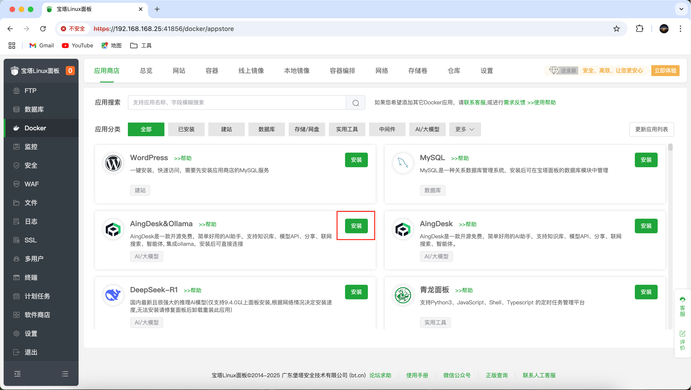
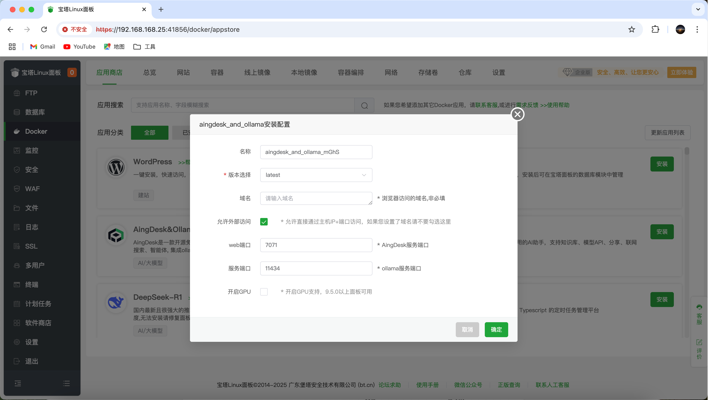
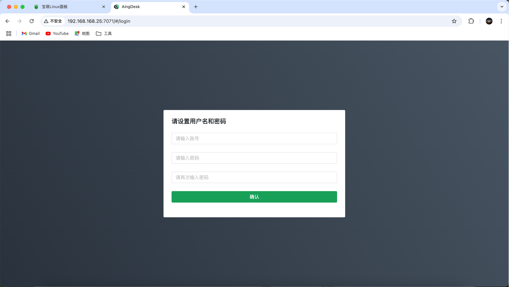

# 宝塔面板

### 前提条件

> 安装 AingDesk 之前, 请确保你的机器已满足最低安装要求：
>
> * CPU >= 1 Core
> * RAM >= 2 GiB

| 操作系统                   | 软件                                 | 描述                                                                                |
| -------------------------- | ------------------------------------ | ------------------------------------------------------------------------------------|
| Linux platforms            | <p>宝塔面板正式版 9.2.0 及以上版本</p> | 请参阅[安装宝塔面板](https://www.bt.cn/new/download.html)  以获取更多信息。            |

### 部署 AingDesk
1. 登录宝塔面板，在菜单栏中点击 Docker，根据提示安装 Docker 和 Docker Compose 服务。
2. 在`Docker-应用商店`中找到 `AingDesk`，点击`安装`

3. 设置域名等基本信息，点击`确定`

   - 名称：应用名称，默认`AingDesk-随机字符`
   - 版本选择：默认`latest`
   - 域名：如需通过域名直接访问，请在此配置域名并将域名解析到服务器
   - 允许外部访问：如你需通过`IP+Port`直接访问，请勾选，如你已经设置了域名，请不要勾选此处
   - 端口：默认`7071`，可自行修改
4. 提交后面板会自动进行应用初始化，大概需要`1-3`分钟，初始化完成后即可访问。

### 访问 AingDesk
```bash
# 使用域名
http://yourdomain/

# 使用IP+端口

http://your_server_ip:7071/
```
