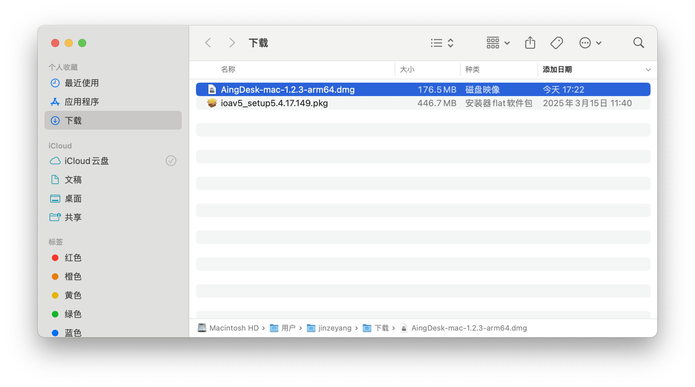
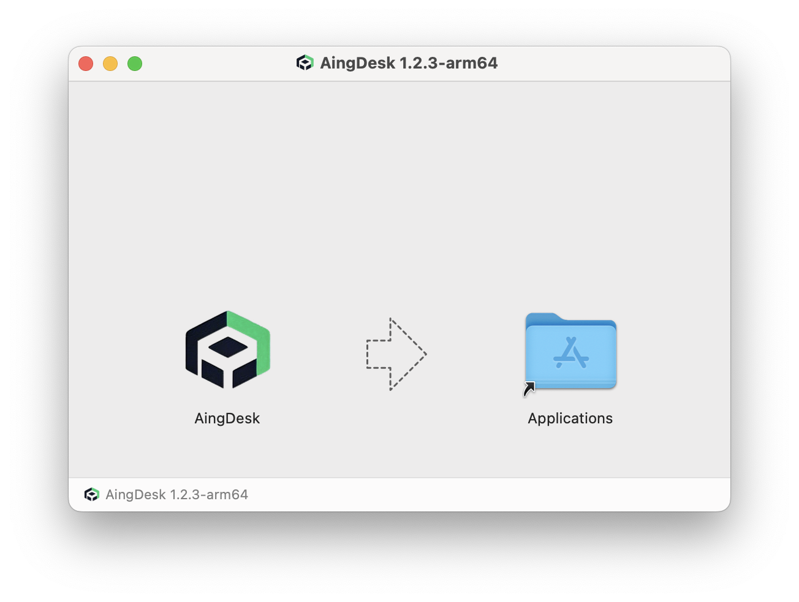
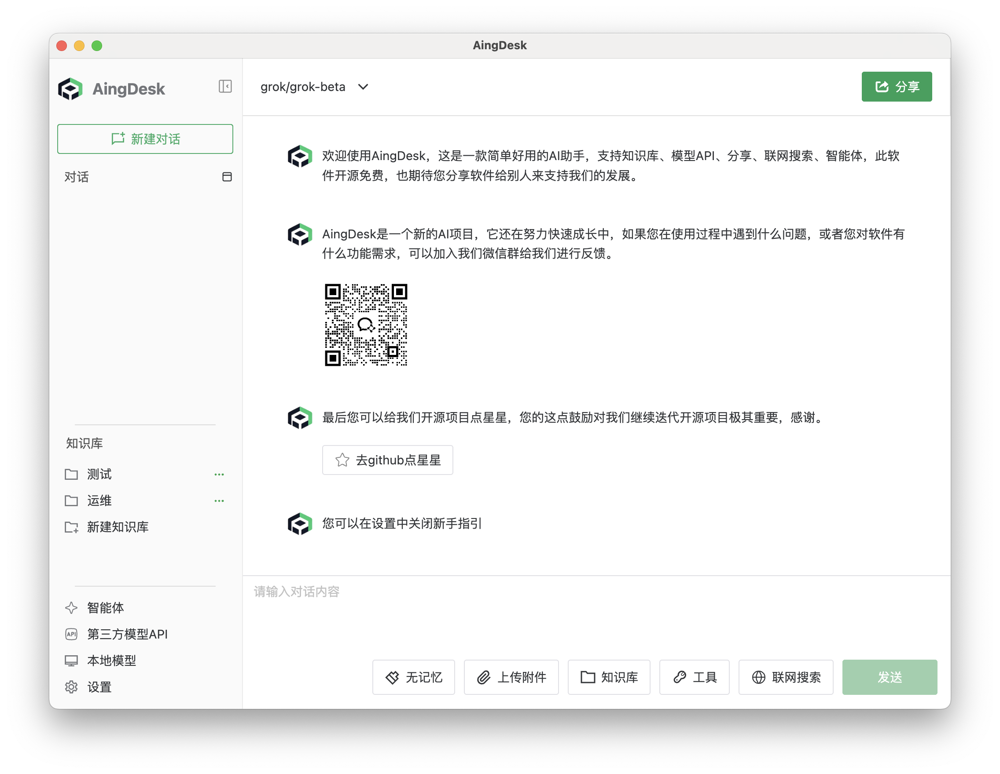

# 在 macOS 上安装 AingDesk

## 操作场景

本文档适用于需要在 macOS 系统上下载安装并初始配置 AingDesk 的用户。

## 操作步骤
### 下载

请访问 [AingDesk 官网](https://www.aingdesk.com/) 下载最新版本的 AingDesk 安装包。

### 安装步骤

1. 双击下载的安装包，启动安装程序。  

2. 按照安装向导的提示完成安装。  

3. 安装完成后，AingDesk 会自动添加到【应用程序】文件夹。您可以在【应用程序】中找到并启动 AingDesk。  

## 注意事项

- 若需卸载，请直接将 AingDesk 拖动到废纸篓即可。
