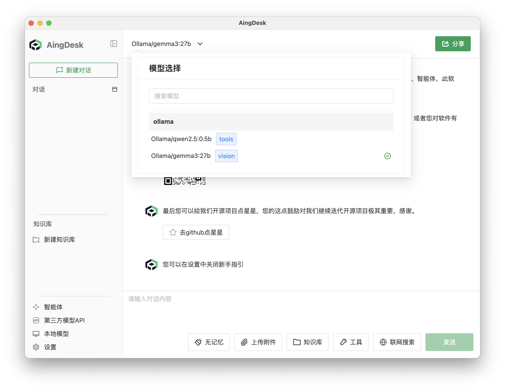
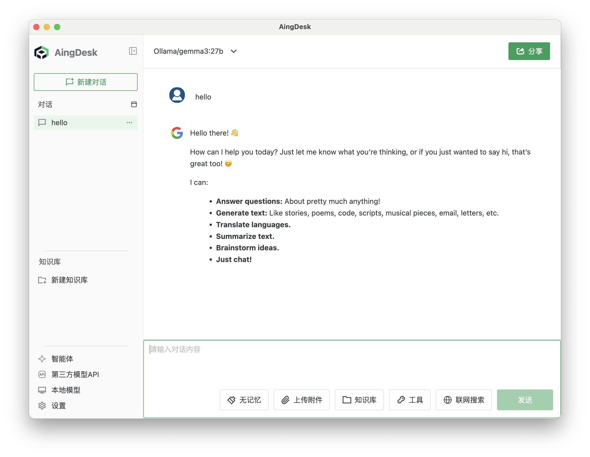
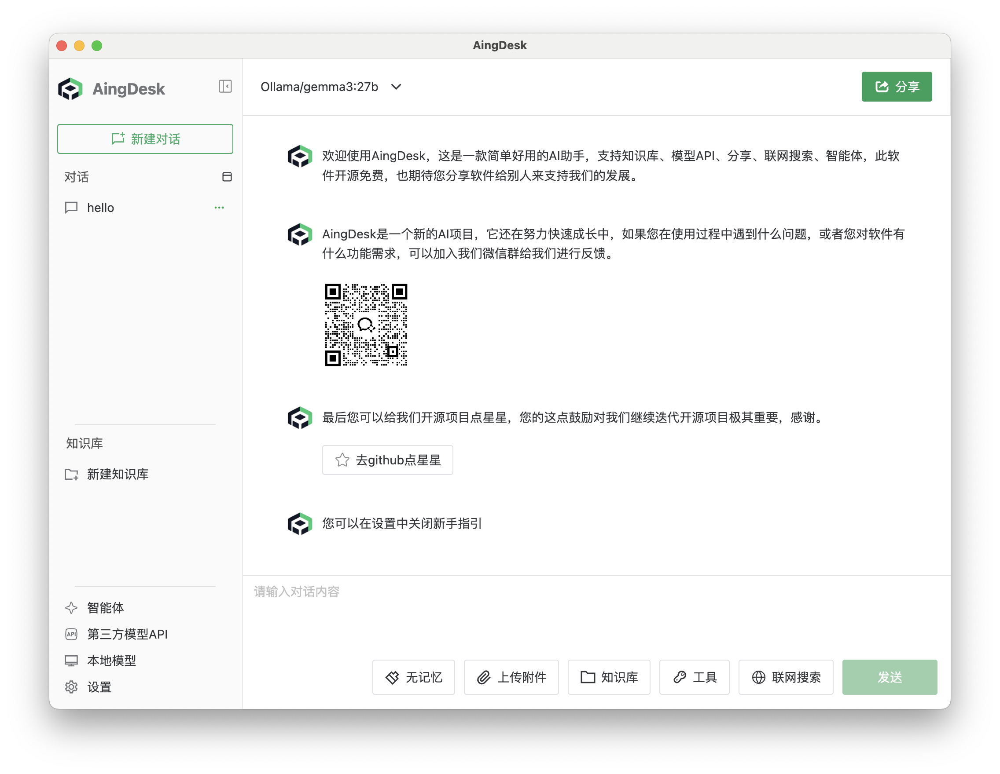
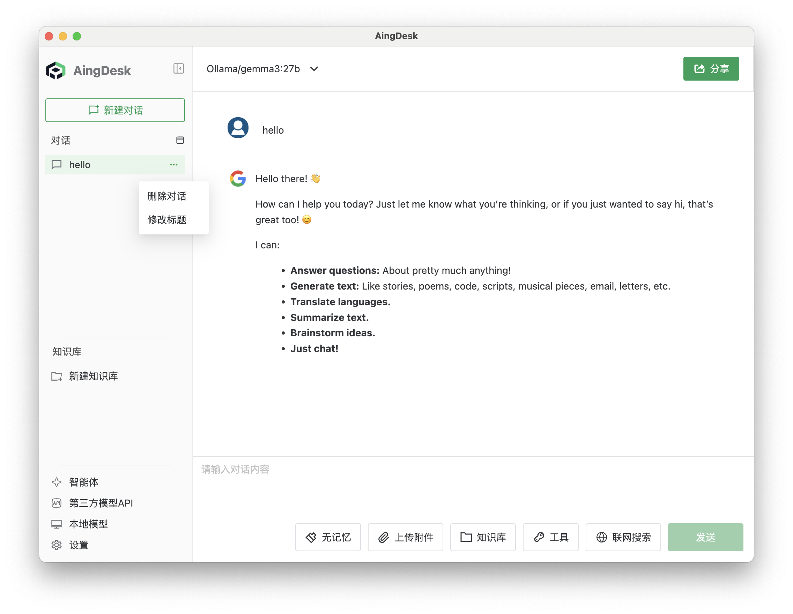

# 聊天

## 操作场景

本文档介绍如何使用聊天功能。聊天功能允许用户与模型进行多轮对话，用户可输入问题或指令，模型将根据输入生成相应回复。

## 前提条件

- 首次使用需[安装本地模型](installing-models)或接入[第三方模型 API](thirdapi)。

## 操作步骤

### 开始对话

1. 首次进入聊天页面后，请先在左上角选择模型。

2. 在对话框中输入需要对话的内容，按回车键发送。

3. 等待模型生成回复。

4. 可继续输入新的问题或指令，与模型进行多轮对话。

### 新建对话

点击左上角的【新建对话】按钮即可新建一个对话。

### 修改和删除对话

在左侧对话列表中，点击对话右侧的【修改标题】按钮可修改对话标题，点击【删除】按钮可删除对话。

