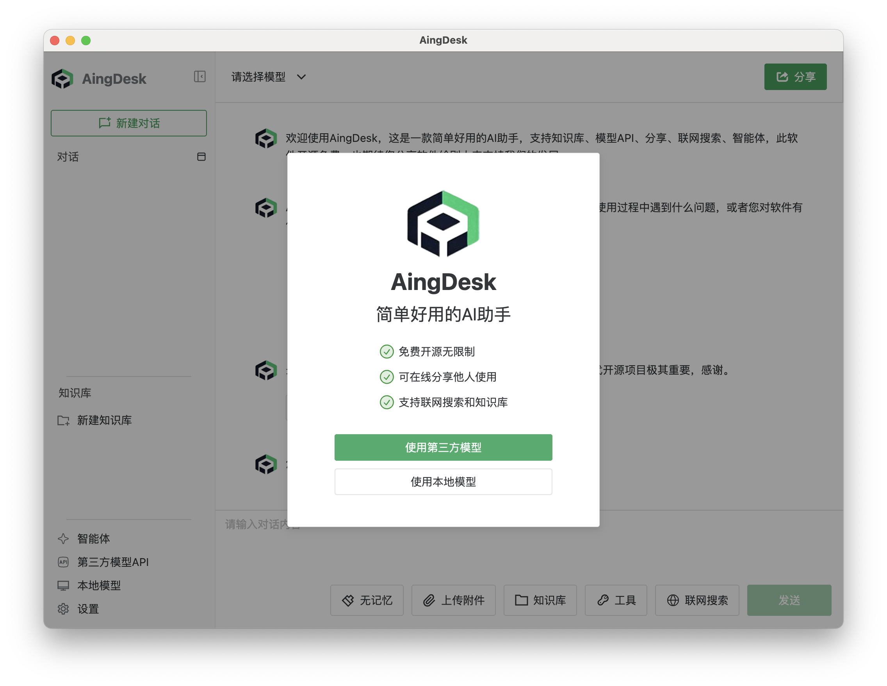
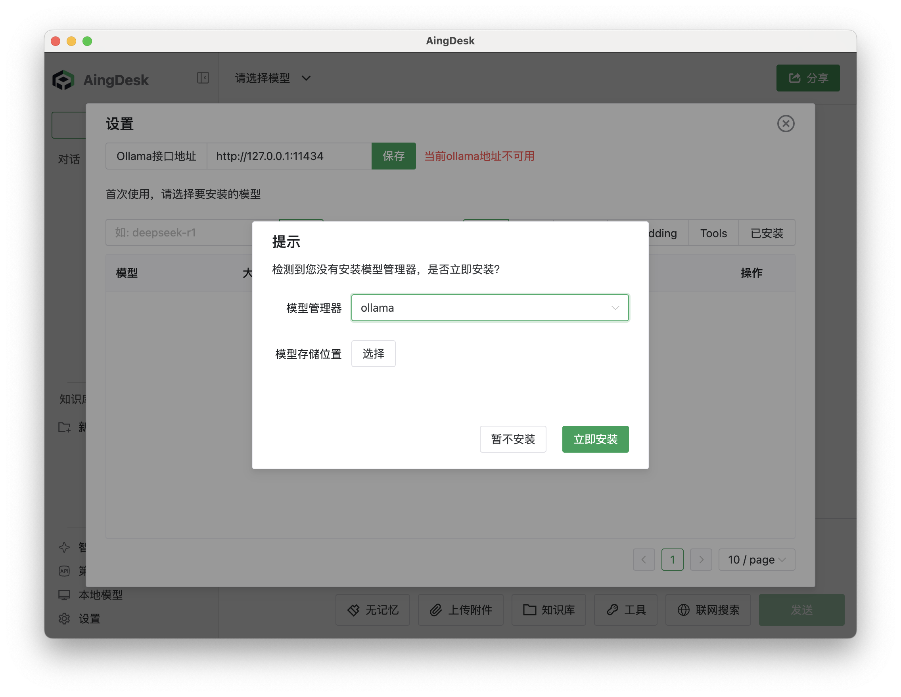
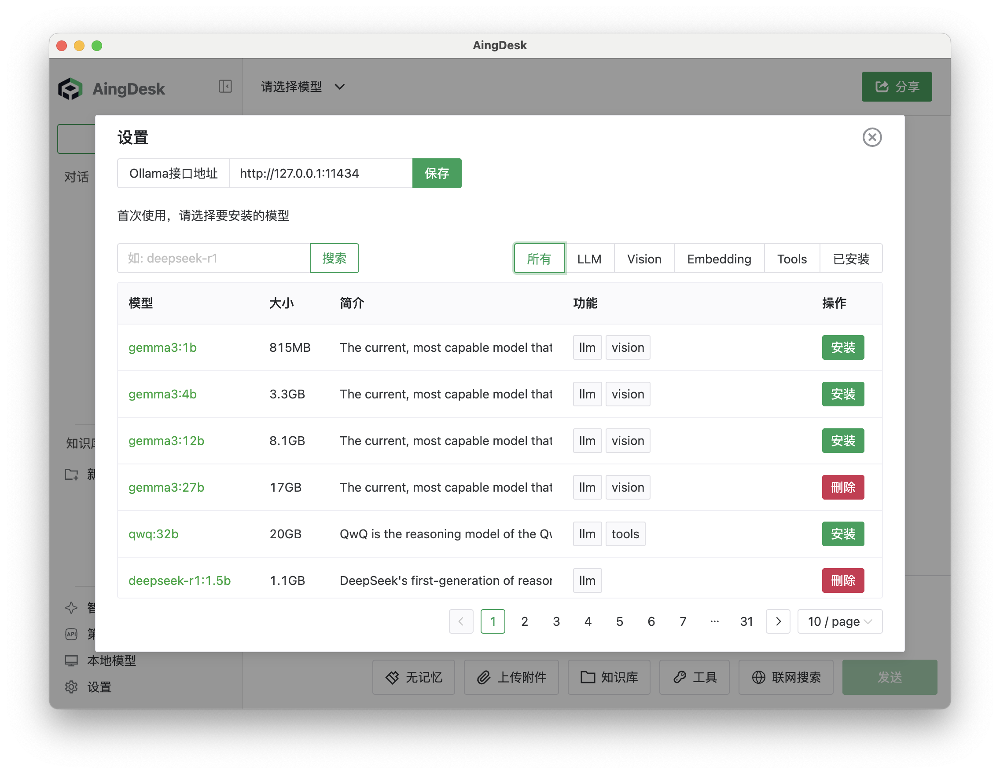
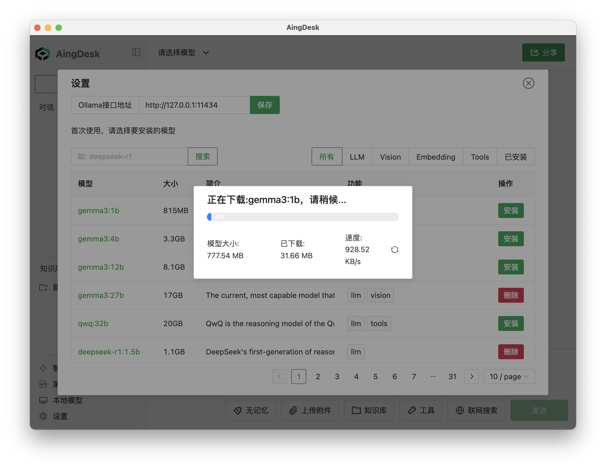
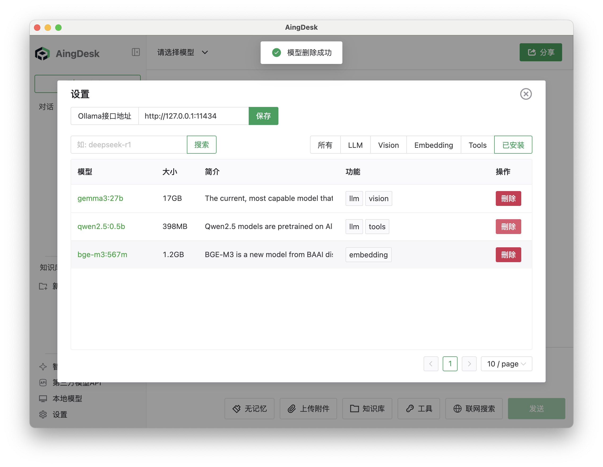

# 安装本地模型

## 操作场景

本文档将指导您如何在 AingDesk 中安装模型管理器并配置本地模型，适用于需要在本地运行大模型的用户。

## 操作步骤

### 安装模型管理器

1. 首次打开 AingDesk 时，系统会提示选择“本地模型”或“第三方模型 API”。如需本地部署，请选择【本地模型】，随后系统将提示安装模型管理器。后续也可通过左下角的【本地模型】按钮进入模型管理器界面。
   
   

2. 选择模型存储位置，点击【立即安装】以开始安装模型管理器。
   
   

3. 等待安装完成。安装完成后，系统会自动进入本地模型管理界面。

:::tip 提示
- 如首次打开时选择跳过安装，可在【本地模型】界面手动安装模型管理器。
- 若模型管理器下载缓慢或无速度，建议前往 [Ollama 官网](https://ollama.com) 直接下载安装。
- 若点击【立即安装】后提示安装失败，请尝试以管理员权限运行 AingDesk，或手动安装模型管理器。
:::

### 安装模型

1. 在模型管理器中，选择需要安装的模型，点击【安装】。
   
   

2. 等待模型下载并自动安装，安装完成后即可在本地模型列表中查看和使用。
   
   

### 删除模型

1. 在模型管理器中，选择需要卸载的模型，点击【删除】。
   
   

2. 等待模型删除完成，模型将从本地模型列表中移除。

---

> **注意事项：**
> - 请确保本地磁盘空间充足，避免因空间不足导致模型安装失败。
> - 推荐在网络环境良好的情况下进行模型下载和安装，以提升安装速度和成功率。