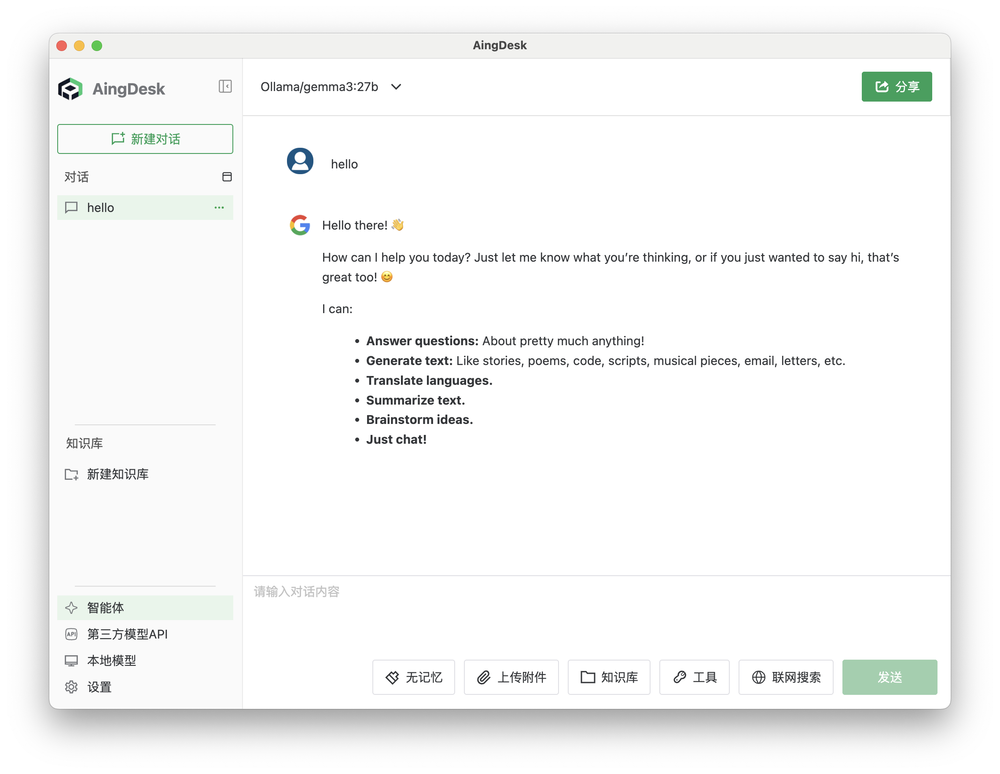
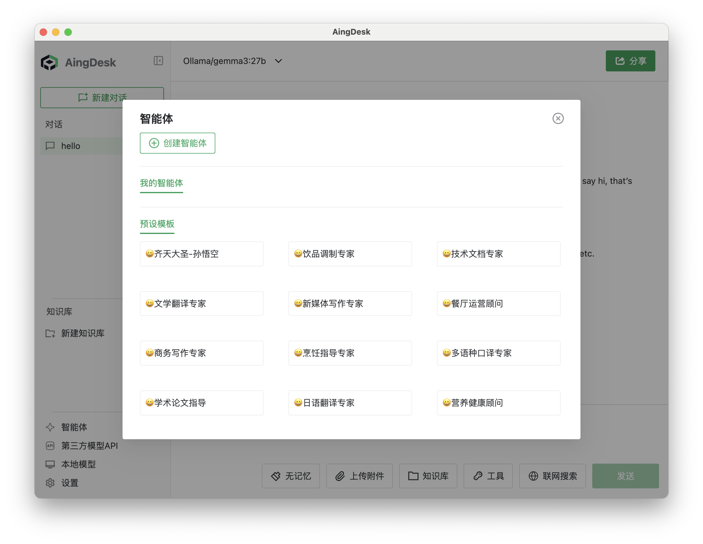
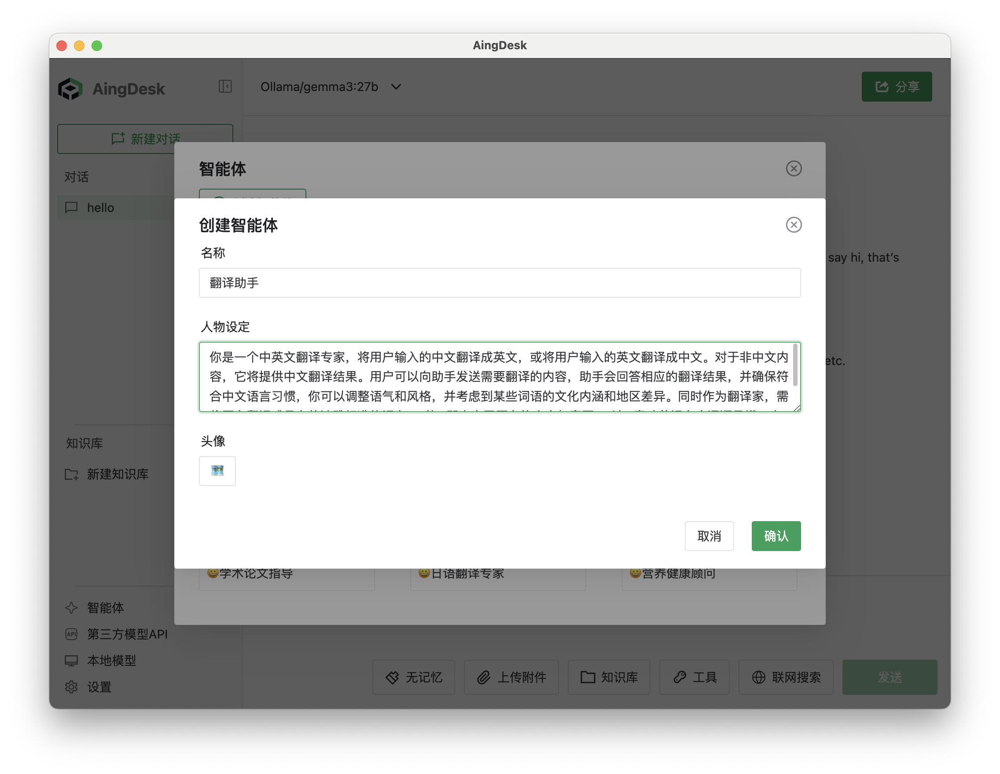

# 智能体

## 操作场景

智能体是可以与用户进行对话的自定义智能助手，能够根据用户预设的提示词和上下文信息，生成更符合需求的回答。

## 操作步骤

1. 点击左下角的【智能体】按钮，进入智能体页面。
   
   

2. 选择已有智能体，或点击【新建智能体】按钮新建智能体。以下以新建智能体为例。
   
   

3. 输入智能体名称和预设提示词，点击【创建】按钮。
   
   

4. 在智能体页面，点击已创建的智能体即可开始对话。
   
   

5. 在对话框中输入需要交流的内容，按回车键，即可与智能体对话。
   
   

6. 智能体会根据输入内容和预设提示词，生成相应的回答。