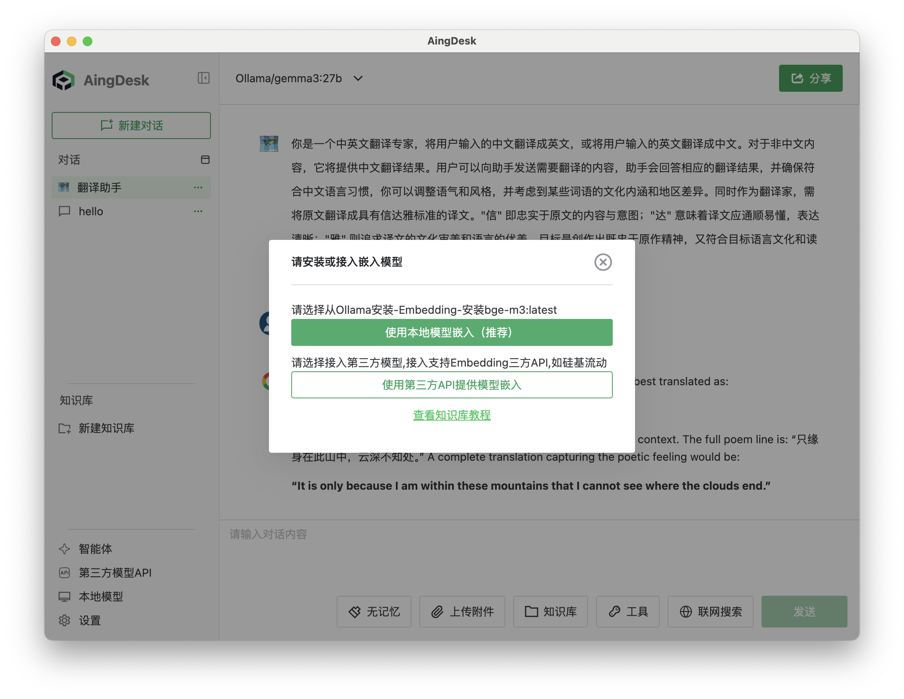
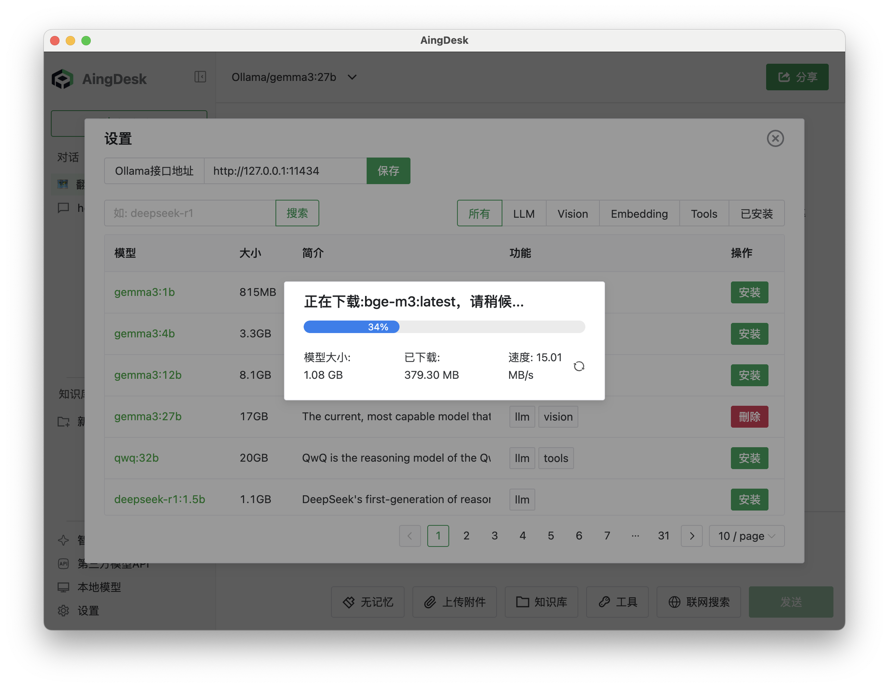
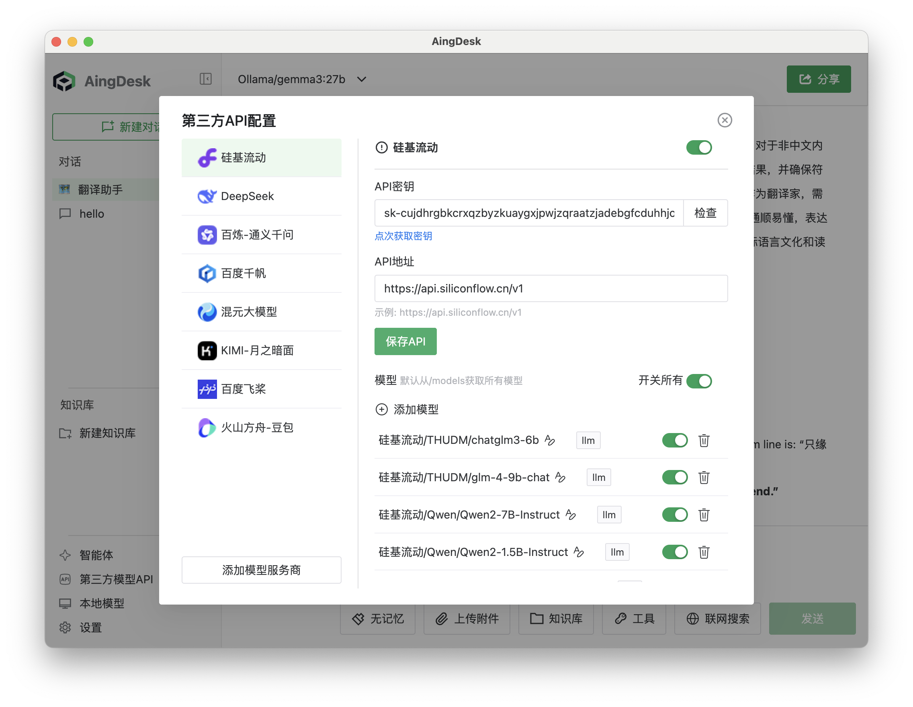
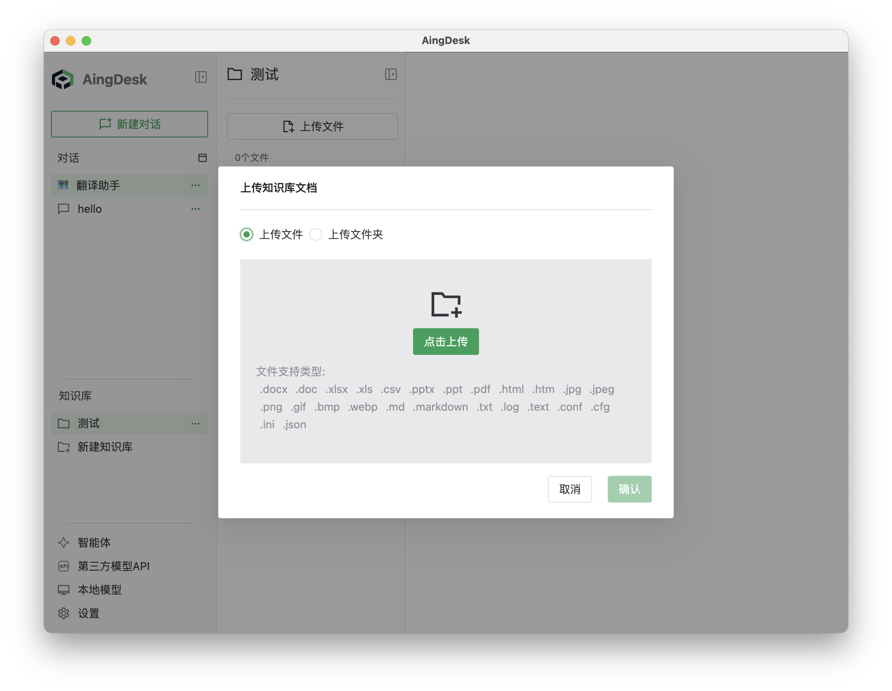
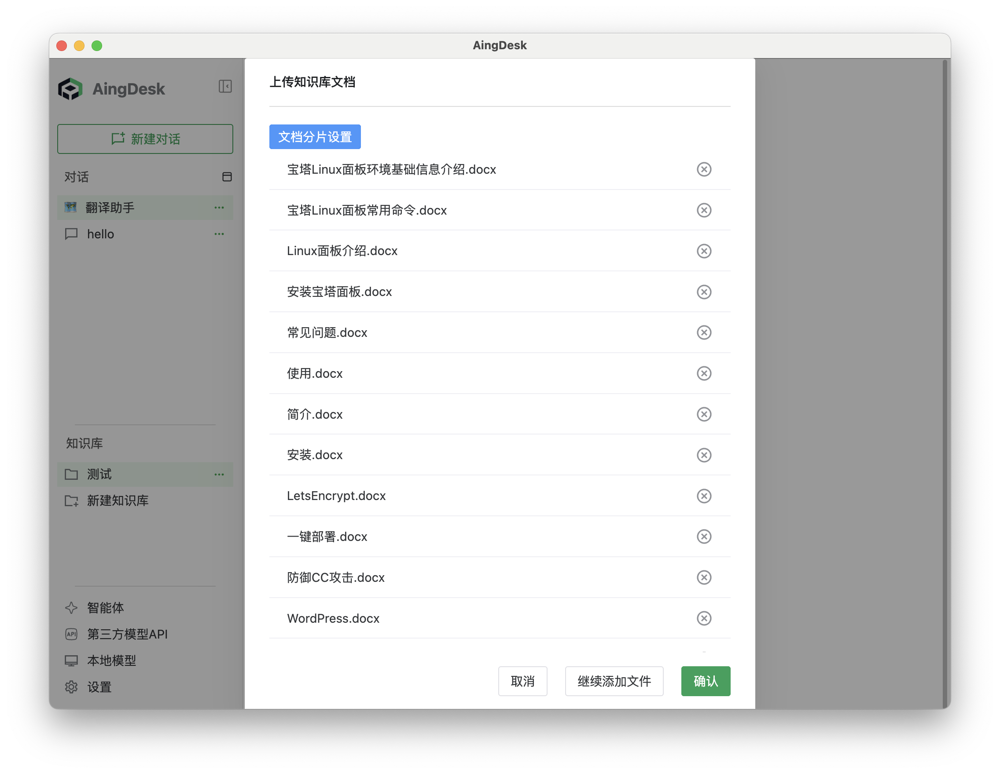
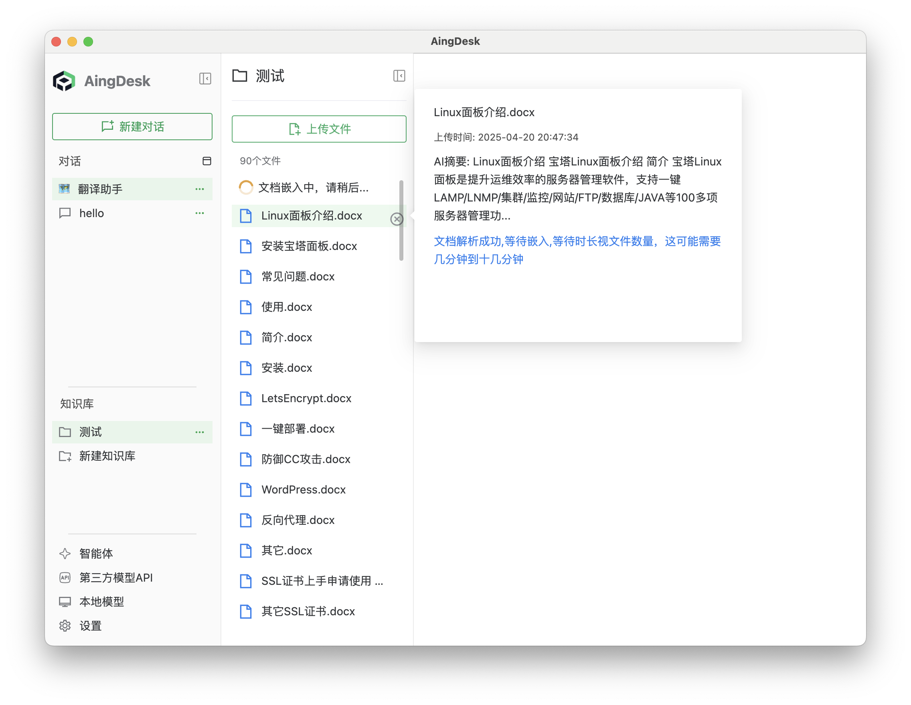
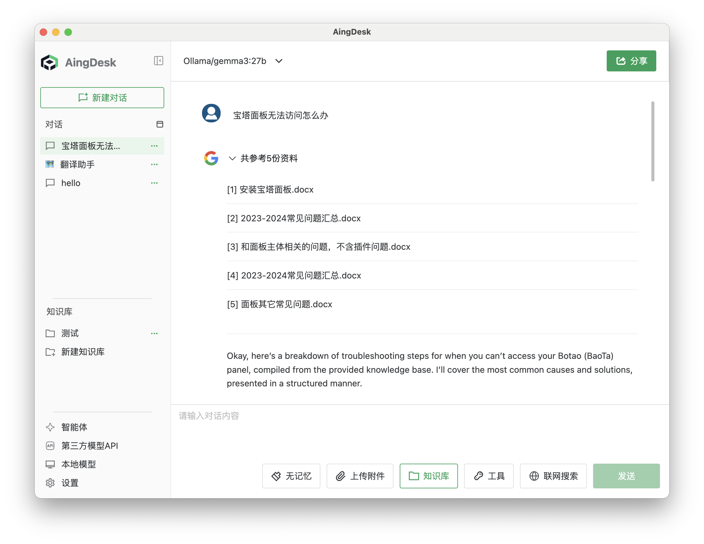

# 知识库
## 安装或接入向量模型
1. 首次点击`新建知识库`时，会提示安装向量模型。

2. 此处分为两种方式，一种是安装本地向量模型，另一种是接入第三方模型API。
- 安装向量模型：点击`使用本地模型嵌入`，等待安装完成。

- 接入第三方模型API：点击`接入第三方模型API`，选择硅基流动，获取并填写API密钥，点击保存。

## 新建知识库
1. 点击左侧导航栏中的`知识库-新建知识库`。
2. 输入知识库名称，选择嵌入模型，点击`确定`。

3. 点击`上传文件`，选择本地文件。

4. 点击确定上传。

5. 上传完成后等待知识库嵌入。

## 使用知识库
1. 在聊天界面，选择`知识库`。
2. 输入问题，点击`发送`。
