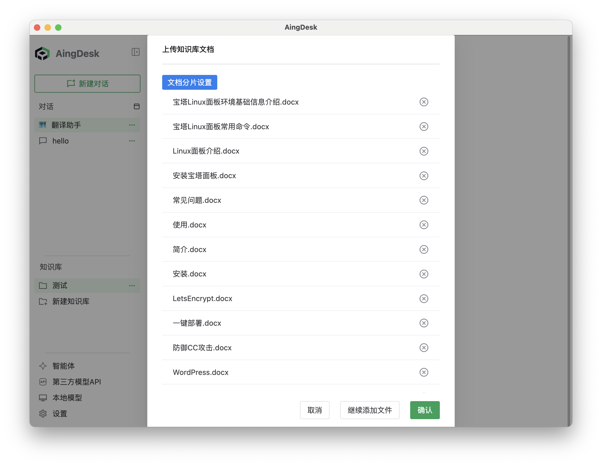
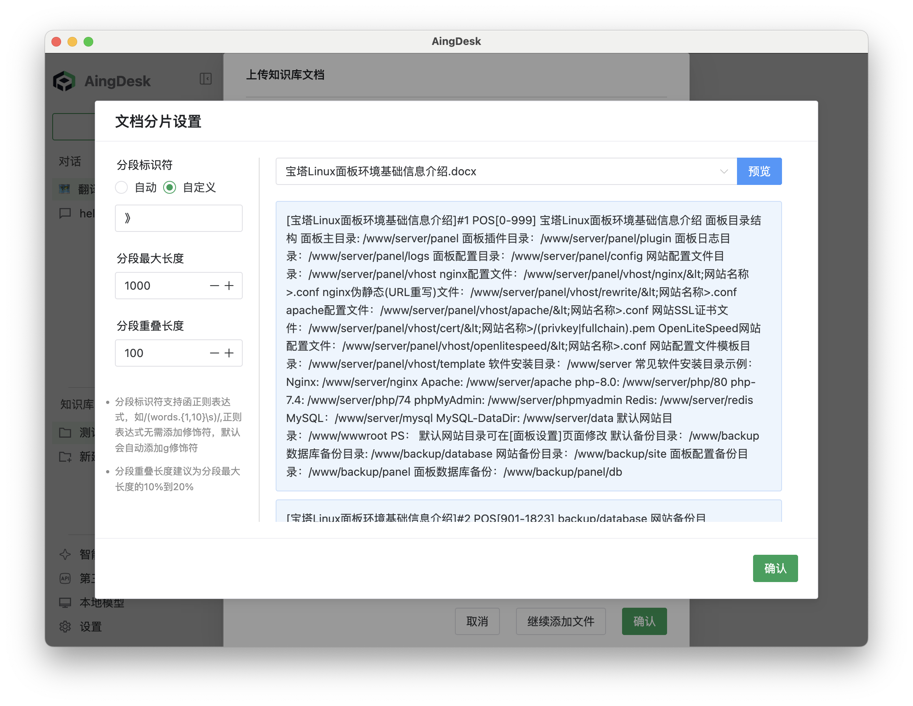

# 知识库

## 操作场景

本文档介绍如何使用知识库功能。知识库可帮助用户快速构建专属知识体系，并通过提问获取相关信息，提升信息检索效率。

## 操作步骤

### 安装或接入向量模型

1. 首次点击【新建知识库】时，系统会提示安装向量模型。
   
   

2. 支持两种方式：安装本地向量模型或接入第三方模型 API。
   - **安装本地向量模型**：点击【使用本地模型嵌入】，等待安装完成。
     
     
   - **接入第三方模型 API**：点击【接入第三方模型API】，选择“硅基流动”，获取并填写 API 密钥，点击【保存】。
     
     

### 新建知识库

1. 在左侧导航栏点击【知识库】-【新建知识库】。
2. 输入知识库名称，选择嵌入模型，点击【确定】。
   
   

   ::: tip 提示
   - 最大召回数量（topK）：用于控制每次查询返回的相关信息数量，默认值为 5。
   :::

3. 点击【上传文件】，选择本地文件。
   
   ::: warning 警告
   - 使用知识库可能会占用较多磁盘空间，建议在设置中更改数据存储路径。
   - 当前不支持识别文件中的图片和表格内容。
   :::

   

4. 为提升知识库精度，建议根据实际需求调整分段设置。如不熟悉可跳过，系统将自动分段。
   
   

5. 若选择手动分段，请自定义分段标识符。
   
   

   ::: tip 提示
   - 分段标识符用于区分不同段落，可为任意字符串，如 `#`、`*` 等。
   - 若无需手动分段，可直接点击【确定】，系统将自动处理。
   - 分段标识符支持正则表达式，如 `/(words.{1,10}\s)/`，无需添加修饰符，系统默认添加 `g` 修饰符。
   - 建议分段重叠长度为分段最大长度的 10%~20%。
   :::

6. 设置完成后，点击【确认上传】。
   
   

7. 上传完成后，系统将自动进行知识库嵌入处理。
   
   

8. 嵌入完成后，即可使用知识库功能。

### 使用知识库

1. 在聊天界面选择【知识库】。
   
   

2. 输入问题，点击【发送】获取答案。
   
   