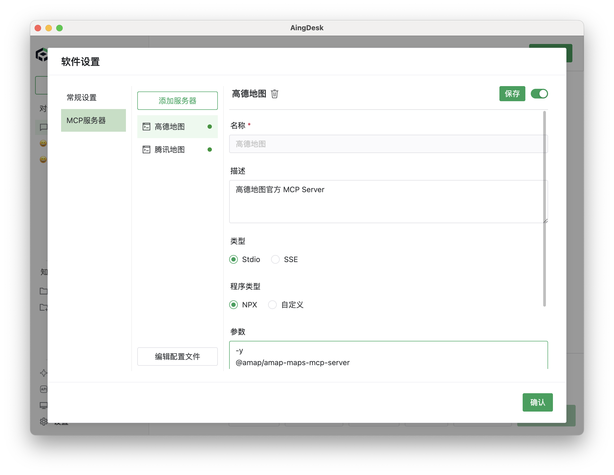
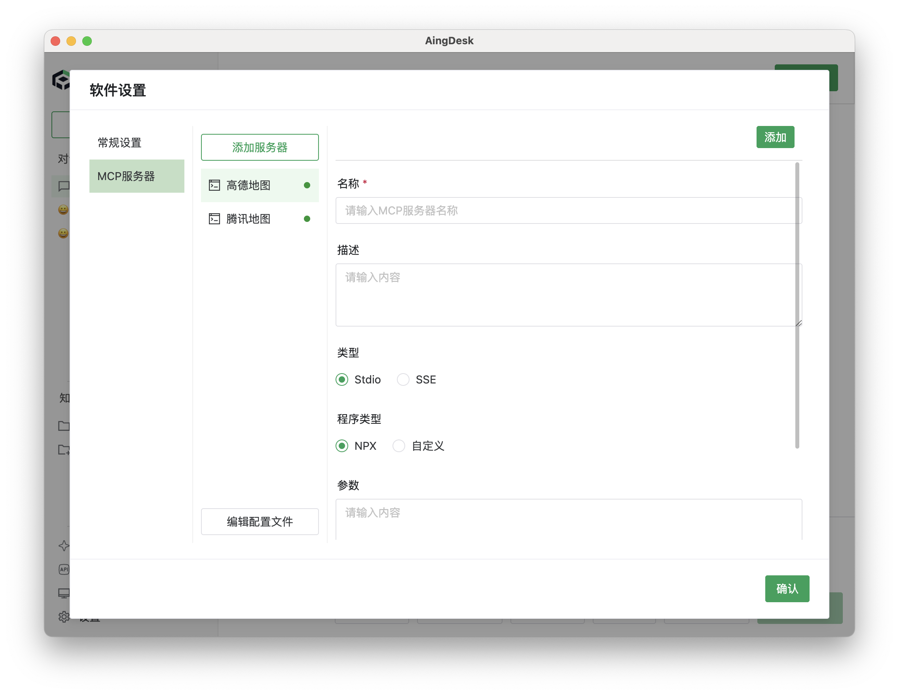

# MCP 服务

## 介绍
MCP （Model Context Protocol，模型上下文协议）定义了应用程序和 AI 模型之间交换上下文信息的方式。 这使得开发者能够 以一致的方式将各种数据源、工具和功能连接到 AI 模型 （一个中间协议层），就像 USB-C 让不同设备能够通过相同的接口连接一样。 MCP 的目标是创建一个通用标准，使 AI 应用程序的开发和集成变得更加简单和统一。

## 使用方法
1. 打开设置界面，切换到MCP服务器选项卡。

2. 点击添加服务器，输入参数后点击，软件目前会自动安装nodejs环境，python后续支持
