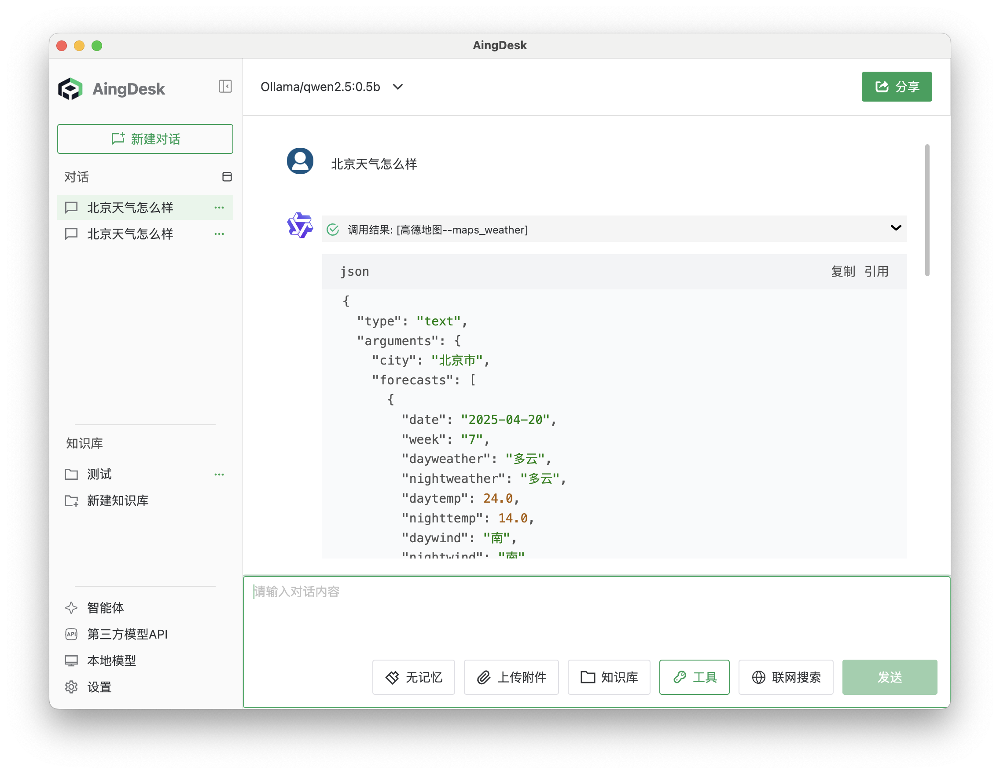

# MCP 服务

## MCP 简介

MCP（Model Context Protocol）是一个开放协议，为应用程序向大语言模型（LLM）提供上下文的方式进行了标准化。你可以将 MCP 理解为 AI 应用程序的 USB-C 接口。就像 USB-C 为设备连接各种外设和配件提供了标准化的方式一样，MCP 为 AI 模型连接各种数据源和工具提供了标准化的接口。

**术语说明：**
- **MCP**：Model Context Protocol，模型上下文协议。
- **LLM**：Large Language Model，大语言模型。
- **AingDesk**：一款简单好用的 AI 助手，支持知识库、模型 API、分享、联网搜索、智能体、MCP 等功能。

## 操作场景

本文档介绍如何在 AingDesk 中使用 MCP 功能，MCP 支持多种工具的接入，用户可以根据需求选择合适的工具进行操作。

## 操作步骤

### 打开设置界面

1. 在 AingDesk 主界面，点击【设置】按钮，进入设置界面。
2. 切换到【MCP 服务器】选项卡。

   

### 添加 MCP 服务器

1. 点击【添加服务器】按钮。
2. 在弹出的对话框中，输入相关参数（如服务器地址、端口等）。
3. 点击【添加】按钮，软件会自动安装依赖包并启动服务。

   

:::tip 提示
当前版本软件会自动安装 Node.js 环境，Python 支持将在后续版本提供。
后续将支持更多功能和优化，敬请期待。
:::

### 使用 MCP 工具

1. 添加服务器完成后，返回【对话】界面。
2. 在工具栏中选择对应的 MCP 工具。
3. 输入消息并发送，即可调用 MCP 服务。

   

## 常见问题

- **Q：添加 MCP 服务器时遇到依赖安装失败怎么办？**  
  A：请检查网络连接，确保可以访问 Node.js 官方源。如有防火墙限制，请联系管理员。

- **Q：如何切换不同的 MCP 工具？**  
  A：在【对话】界面工具栏中选择需要的工具即可。

## 注意事项

- 软件自动安装 Node.js 环境，建议在具备管理员权限的环境下运行。
- 后续版本将支持 Python 等更多运行环境。

