# 使用高德地图 MCP 服务器

## 操作场景

本文将为您介绍如何在 AingDesk 中安装并调用高德地图的 MCP 服务器，实现地图服务的集成。通过接入高德地图，您可以在 AingDesk 中使用高德地图的多种功能，如地理位置查询、路线规划、天气查询、IP 定位等。

## 使用教程

1. 打开 [高德地图开发者平台](https://lbs.amap.com)，注册并登录账号。
   
   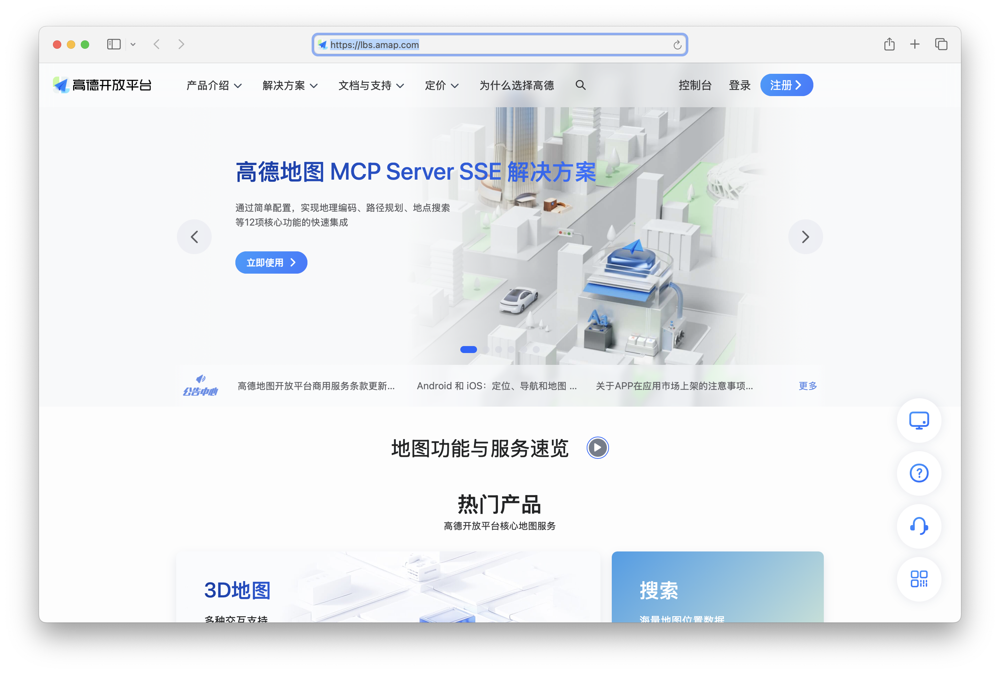

2. 点击【应用管理】-【我的应用】-【创建新应用】。
   
   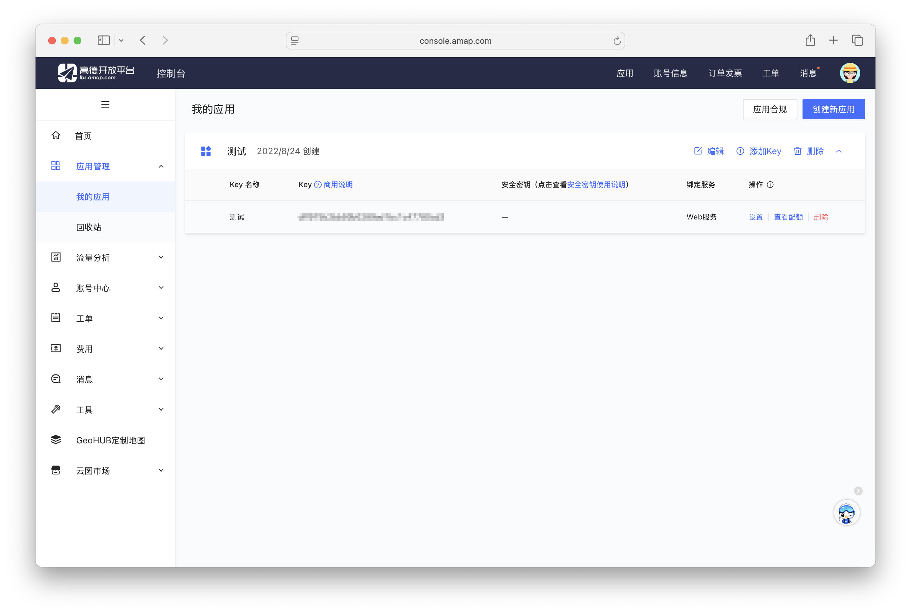

3. 填写应用名称、应用类型等信息，点击【创建】。
   
   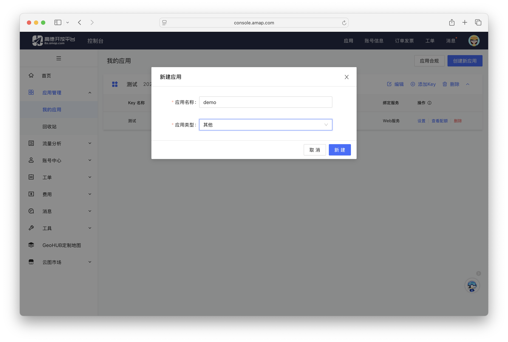

4. 创建完成后，点击【添加 key】。
   
   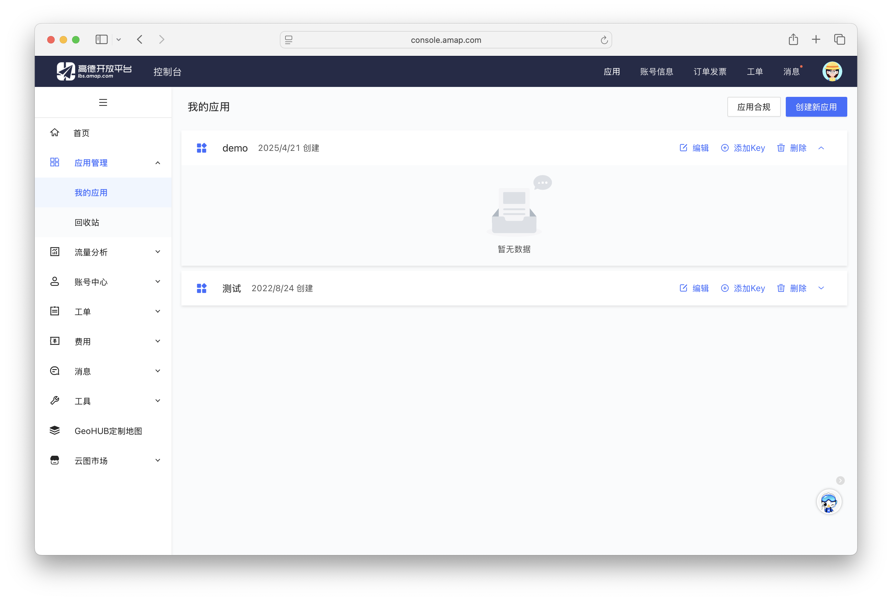

5. 服务平台选择“Web服务”，其他按需设置，点击【提交】。
   
   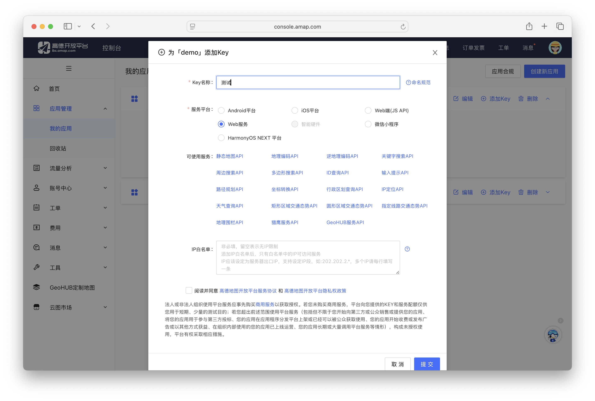

6. 创建完成后，点击【查看 key】。
   
   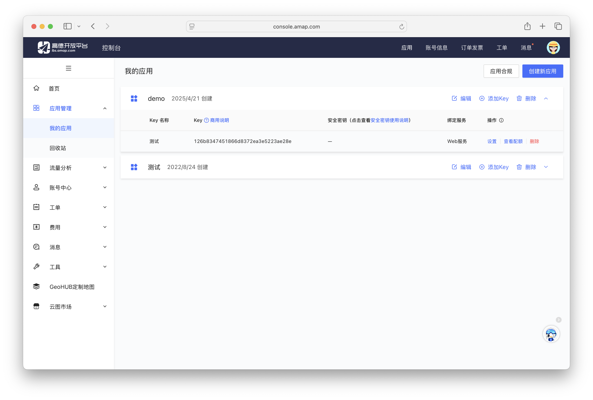

7. 在 AingDesk 中，点击左侧导航栏的【设置】。
   
   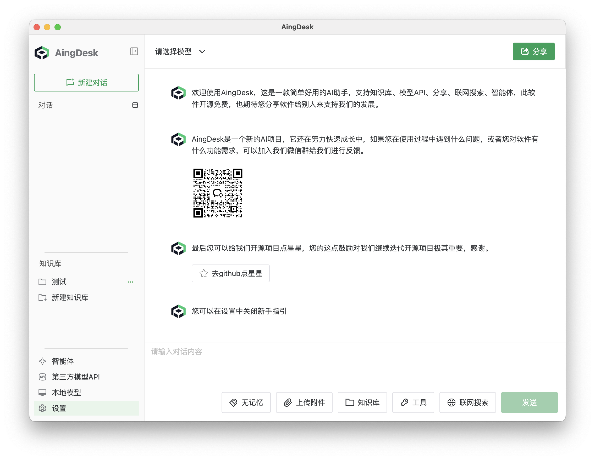

8. 在设置页面中，点击【MCP】选项，并点击【添加服务器】按钮，选择【高德地图】。
   
   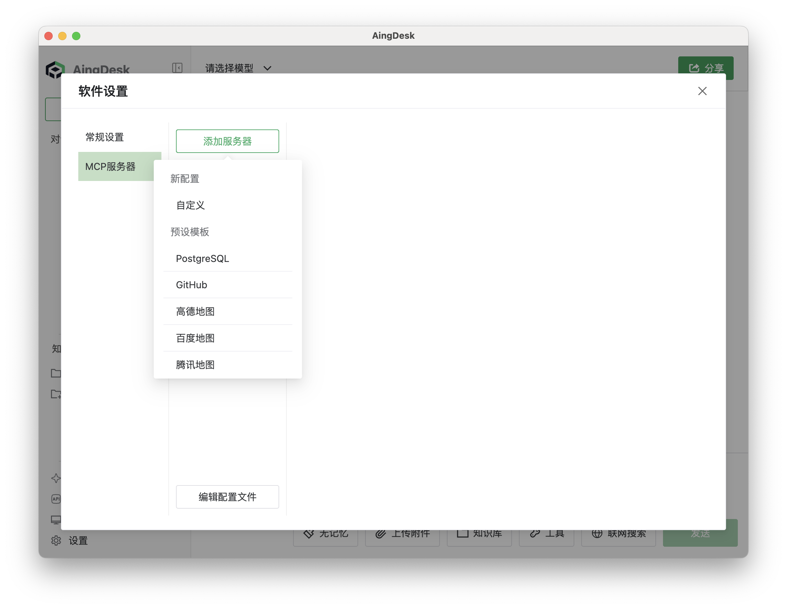

9. 在环境变量中填写高德地图的 key，点击【添加】。
   
   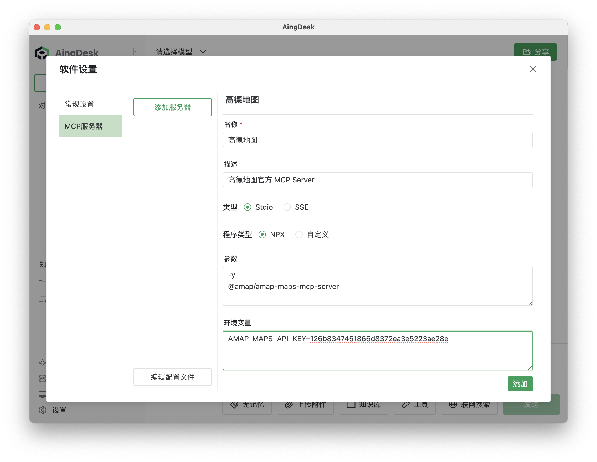

10. 添加完成后，如果服务正常，您应能在列表中看到高德地图的服务，并显示为绿色。
    
    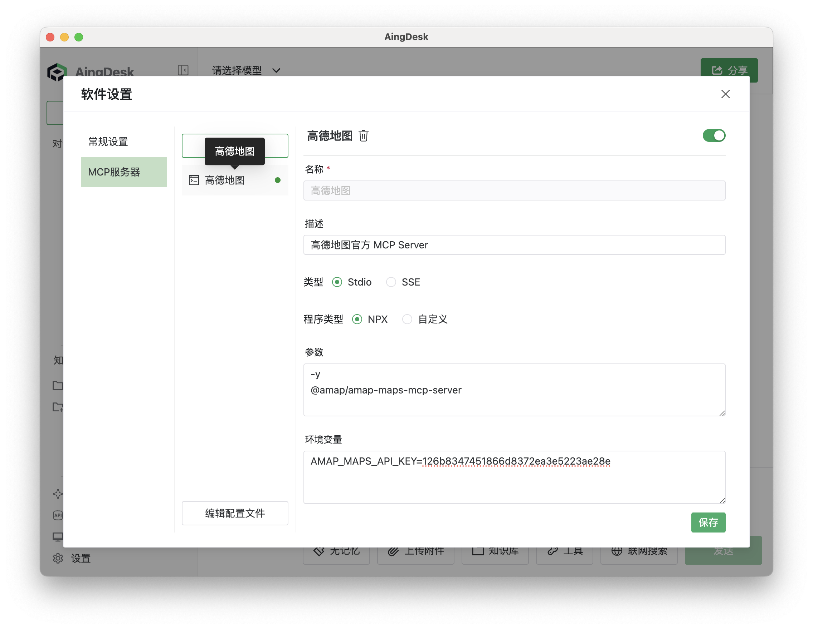

11. 在聊天界面中，您可以使用高德地图的多种功能，如地理位置查询、路线规划、天气查询、IP 定位等。
    
    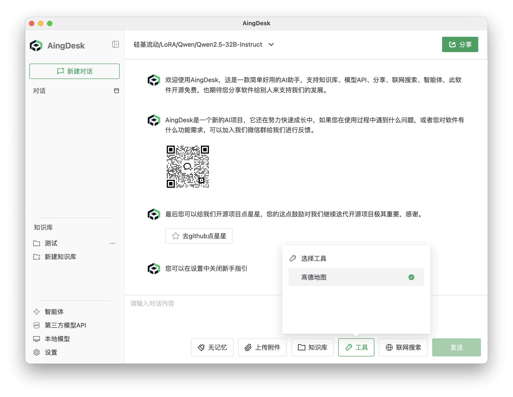

12. 例如，您可以输入“查询北京的天气”，系统将返回北京的天气信息。
    
    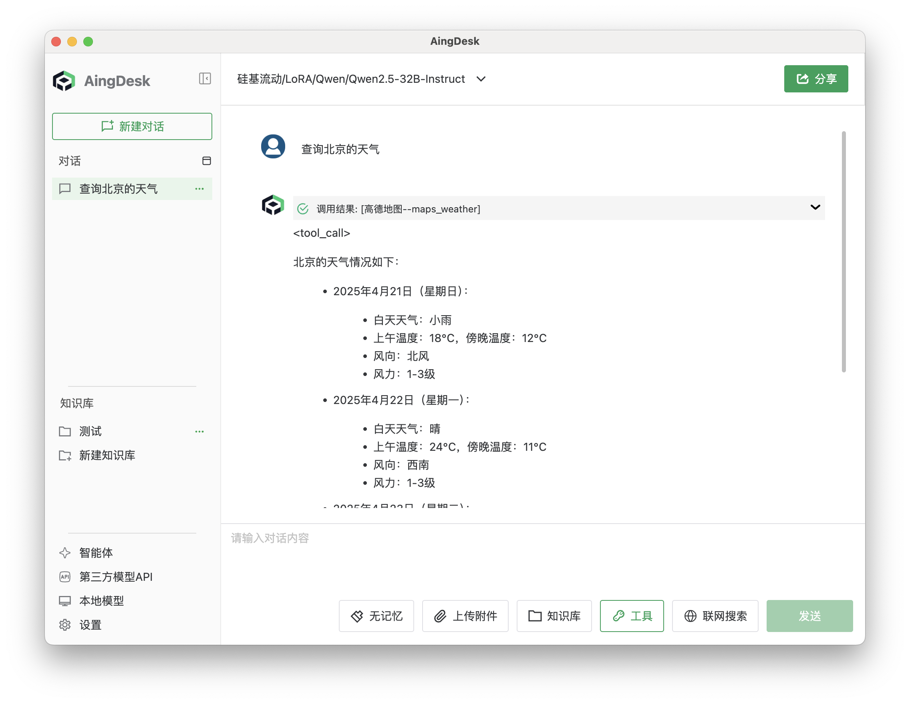