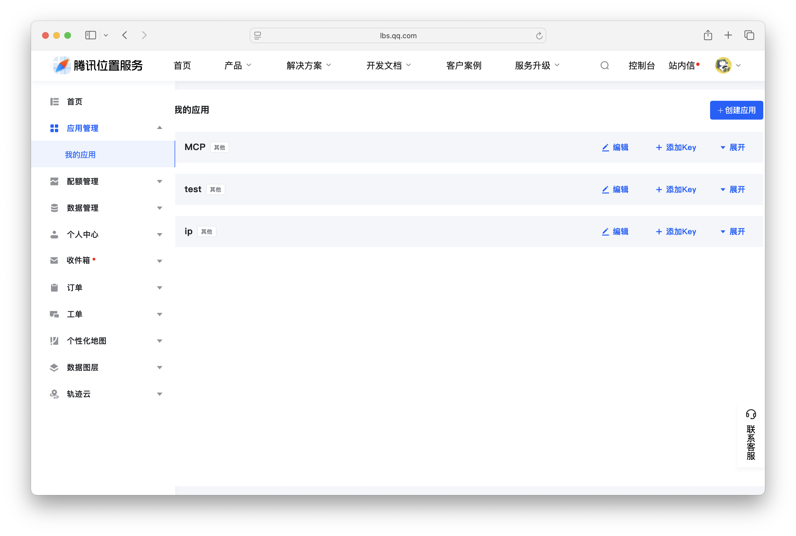
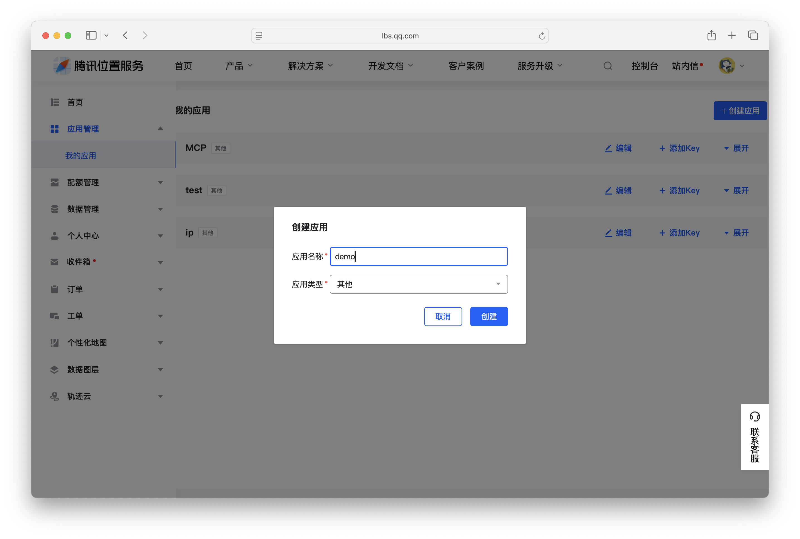
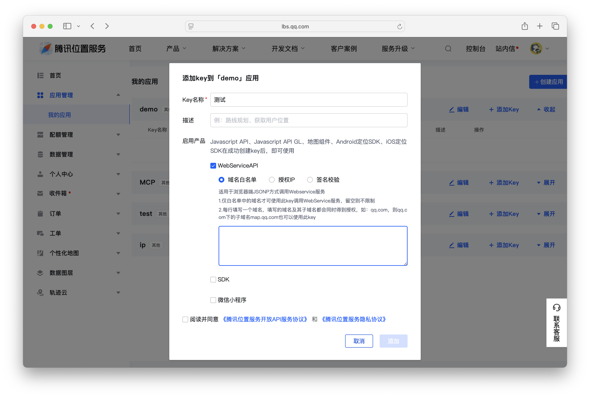
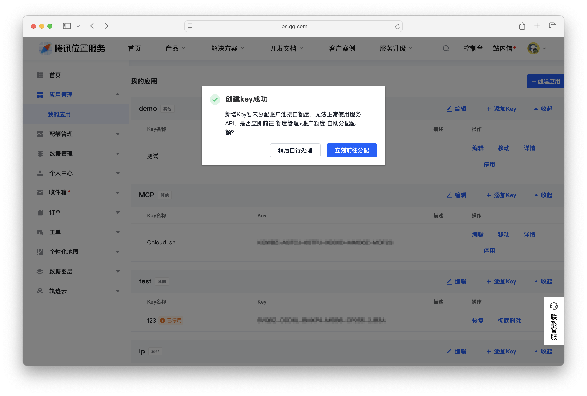
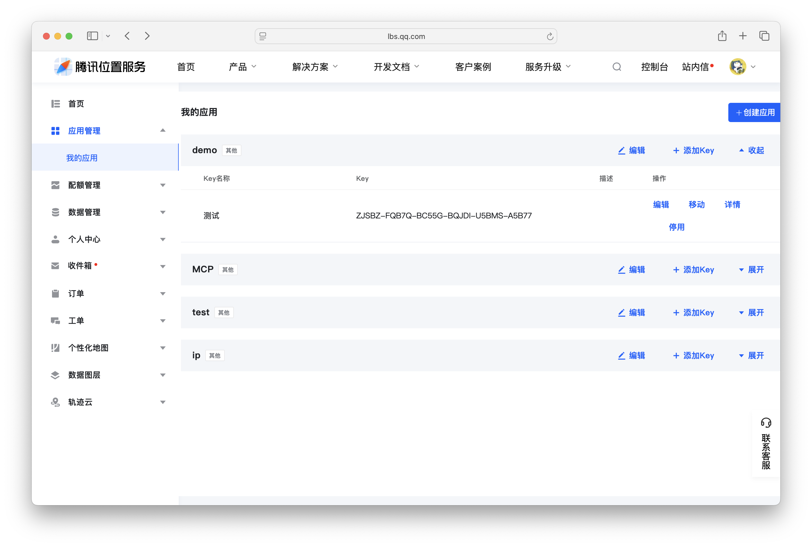
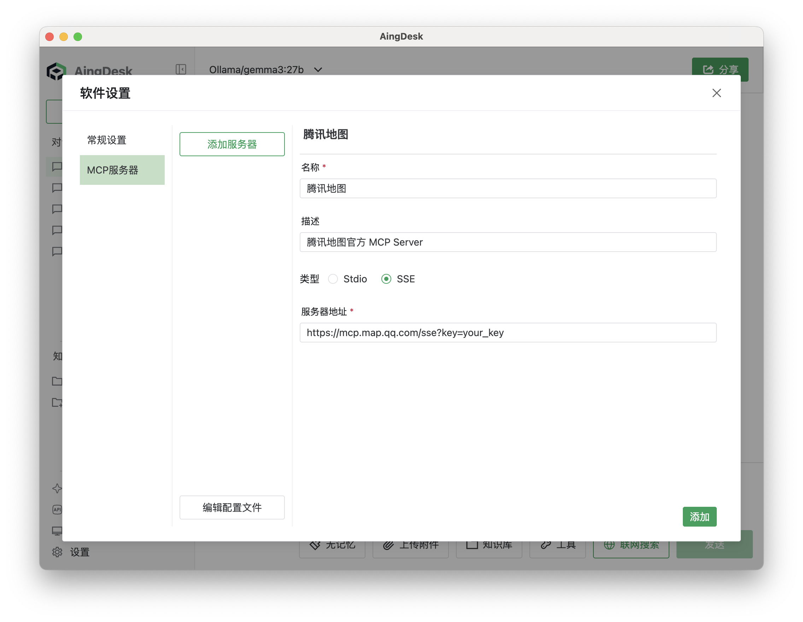
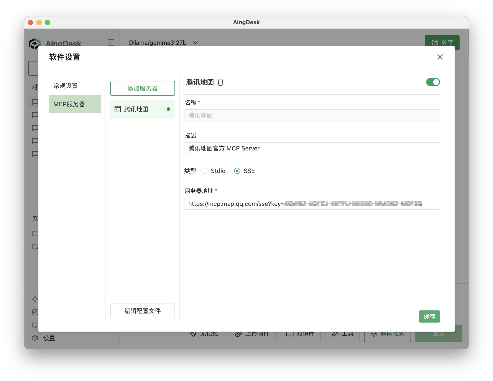
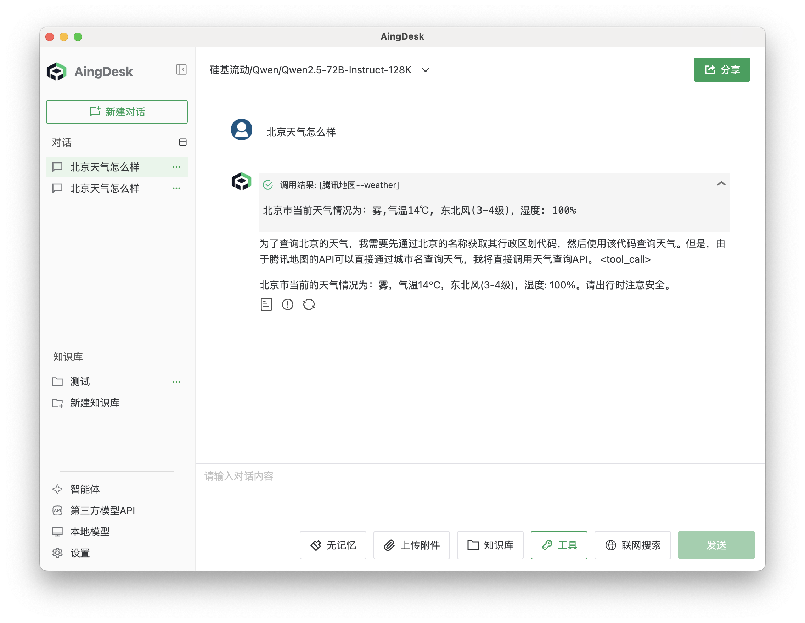

# 使用腾讯地图 MCP 服务器 
## 操作场景
本文将为您介绍如何在 AingDesk 中安装并调用腾讯地图的 MCP 服务器，实现地图服务的集成。通过接入腾讯地图，您可以在 AingDesk 中使用腾讯地图的多种功能，如地理位置查询、路线规划、天气查询、IP 定位等。（腾讯地图的MCP采用SSE方式接入，因此无需安装任何环境）

## 操作步骤
1. 打开 [腾讯地图开发者平台](https://lbs.qq.com/dev/console/home)，注册并登录账号。
    
    

2. 点击【应用管理】-【我的应用】-【创建应用】。
        
    

3. 填写应用名称、应用类型等信息，点击【创建】。
       
    

4. 创建完成后，点击【添加key】，在弹出的窗口中选择WebService API，填写相关信息，点击【添加】。
         
    
5. 点击添加后会弹出`新增Key暂未分配账户池接口额度，无法正常使用服务API，是否立即前往 额度管理>账户额度 自助分配配额？`，请按照提示自行分配额度。
         
    
6. 查看并复制已添加的Key。
         
    

7. 在 AingDesk 中，点击左侧导航栏的【设置】。
   
   

8. 在设置页面中，点击【MCP】选项，并点击【添加服务器】按钮，选择【腾讯地图】。
   
   

9. 替换服务器地址里面的`your_key`为您在腾讯地图开发者平台上获取的密钥，点击【添加】。
   
   
10. 添加完成后，如果服务正常，您应能在列表中看到腾讯地图的服务，并显示为绿色。
    
    
11. 在聊天界面中，您可以使用腾讯地图的多种功能，如地理位置查询、路线规划、天气查询、IP 定位等。
    
    
12. 例如，您可以输入“查询北京天气”，系统将返回当前天气信息。

