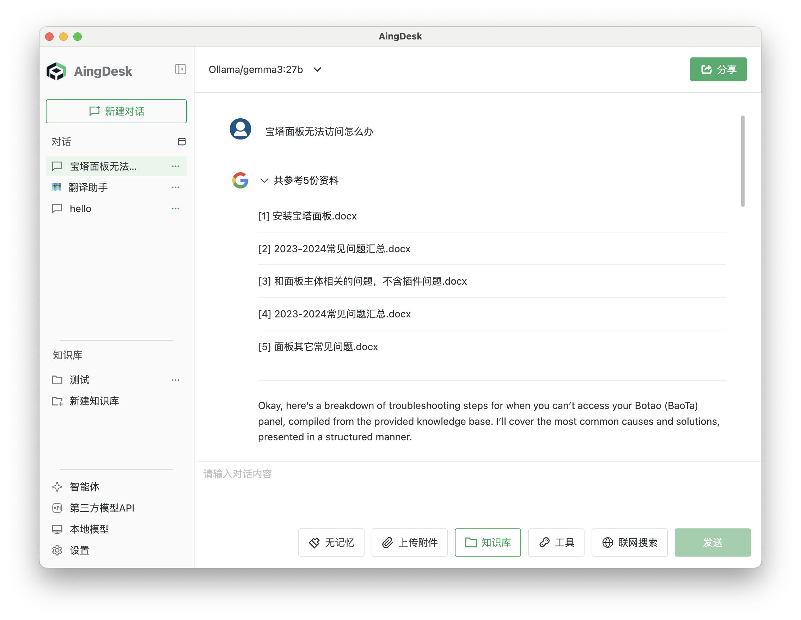
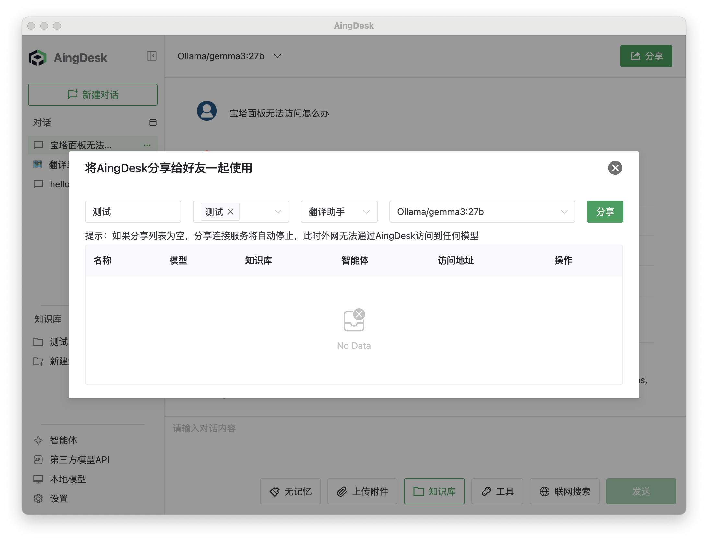
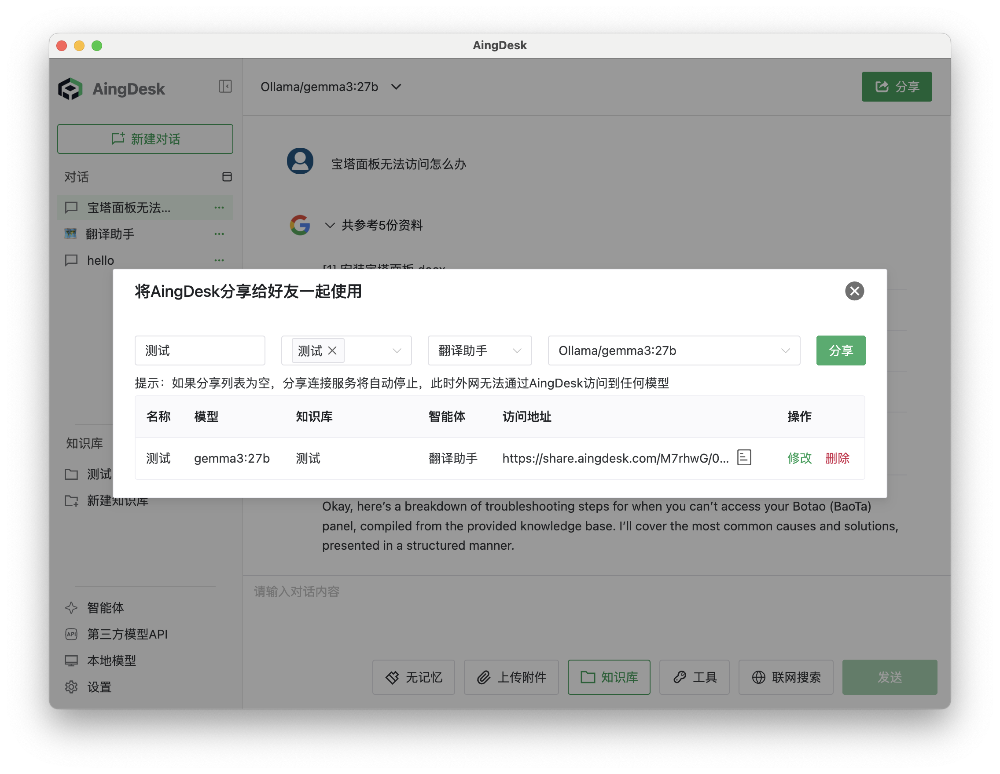
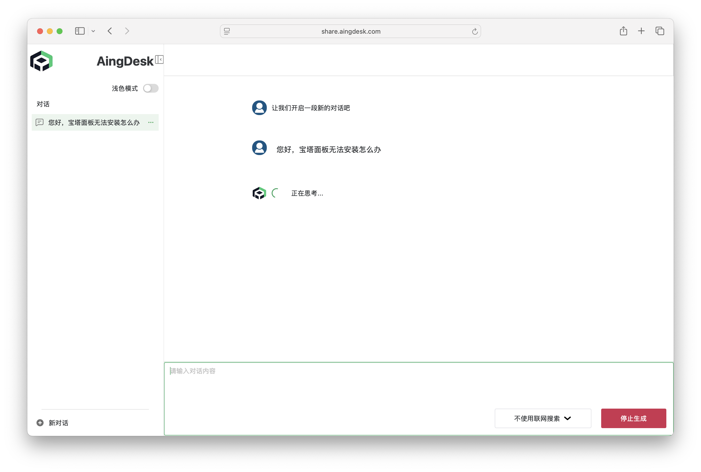

# 分享

## 操作场景

本文档将指导您如何将已部署的模型，以及本地的智能体和知识库，分享给其他用户使用。

## 前提条件

- 当前仅支持外网分享，需要确保您的机器能够访问外网。

## 操作步骤

### 创建分享链接

1. 点击界面右上角的【分享】按钮。

   

2. 选择需要分享的模型，设置名称后，点击【分享】按钮。

   

3. 等待系统生成分享链接后，点击【复制链接】即可将链接分享给其他用户。

   

> **提示：**
>
> 使用分享功能时，需要保证应用程序处于运行状态。

### 使用分享模型

1. 点击收到的分享链接，进入分享页面。

   

2. 在输入框中输入对话内容，点击【发送】按钮，即可与模型进行对话。

> **说明：**
>
> 分享功能目前仅支持模型、智能体和知识库的外网访问，后续将支持更多分享场景。
