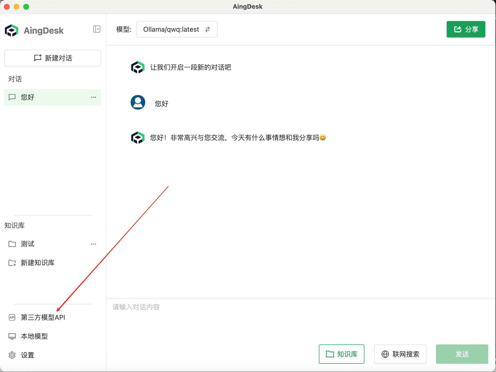
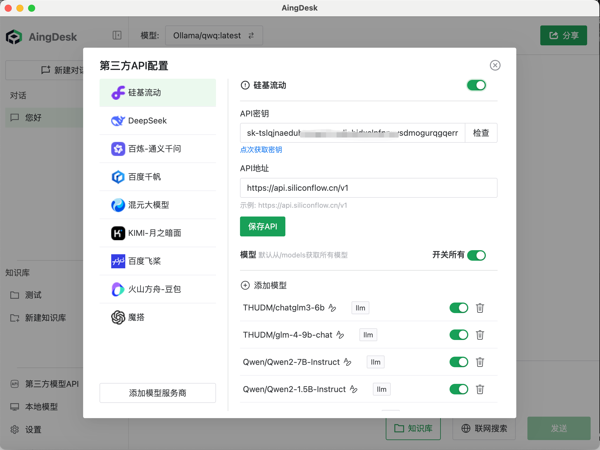
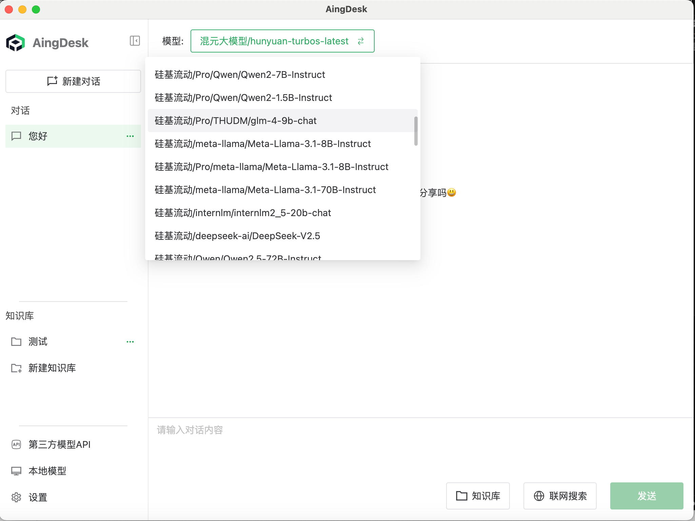

# 使用第三方模型API
AingDesk支持接入第三方API，可以通过接入第三方API调用第三方模型。

## 使用教程
1. 在左侧导航栏点击`第三方模型API`。

2. 选择对应的模型厂商，填写API密钥，并点击保存

密钥可参考：https://mp.weixin.qq.com/s/IfV3Lz1AxvMAX0ys42J-_A 获取。
3. 在聊天界面选择第三方模型，即可使用。
