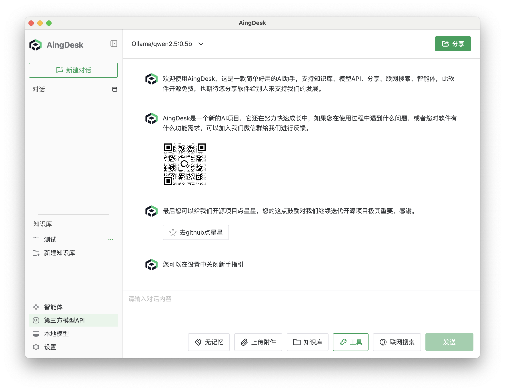
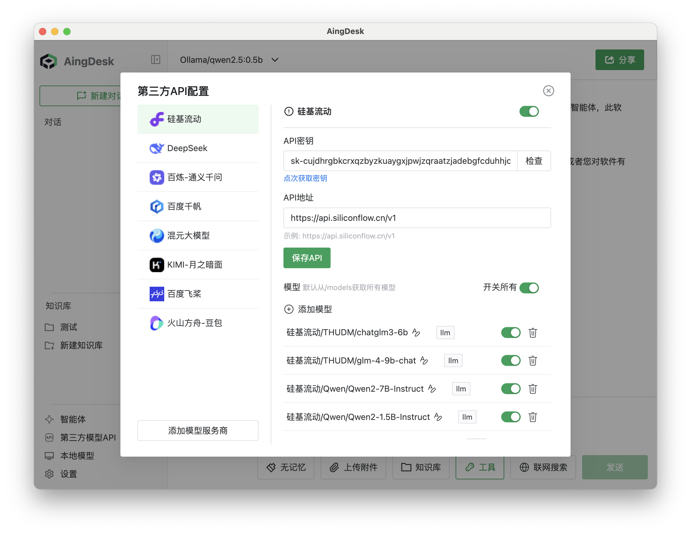
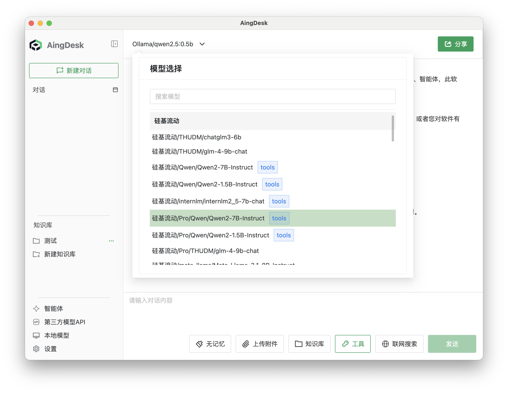

# 使用第三方模型 API

## 操作场景

本文将指导您如何在 AingDesk 中使用第三方模型 API 功能。通过接入第三方模型 API，您可以集成第三方厂商提供的大模型服务。

## 使用教程

1. 在左侧导航栏点击【第三方模型 API】。
   
   

2. 选择对应的模型厂商，填写 API 密钥，并点击【保存】。
   
   

3. 在聊天界面选择第三方模型，即可使用。
   
   

:::tip 提示
更多厂商的接入教程请查看文档左侧导航栏。
:::