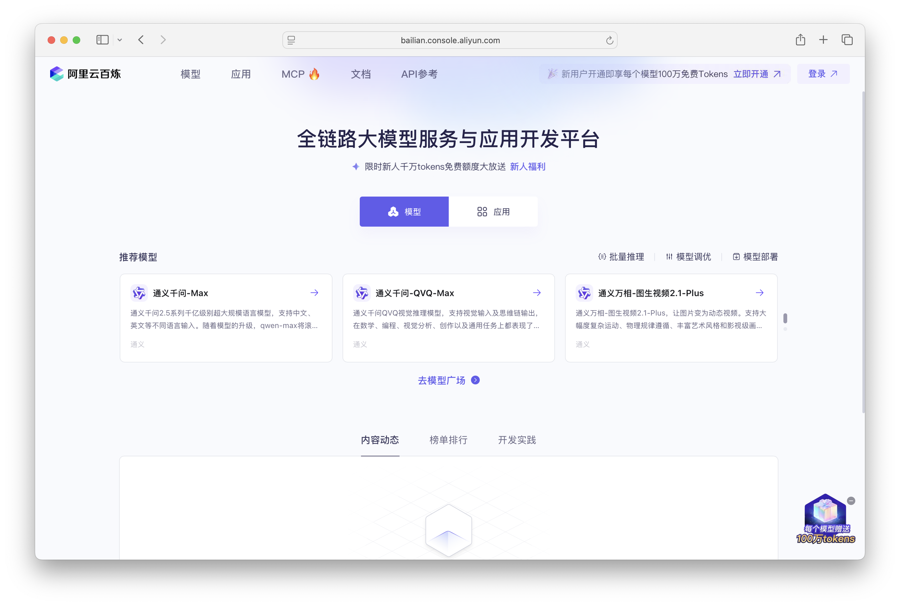
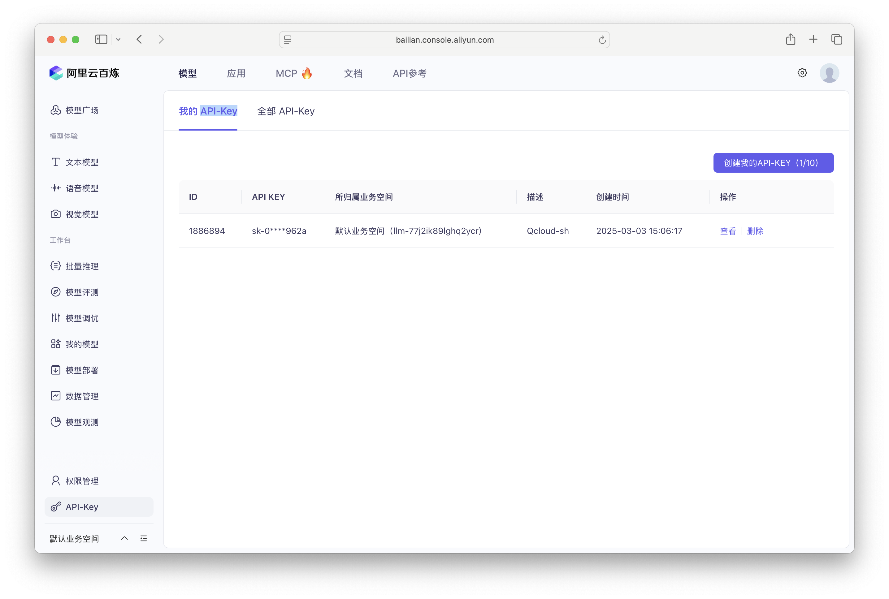
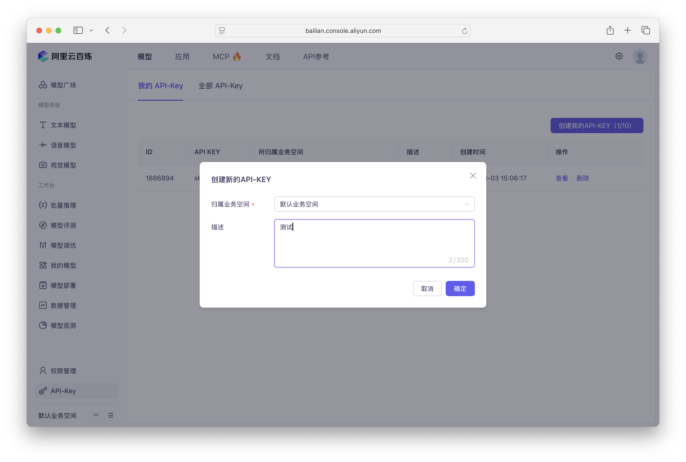
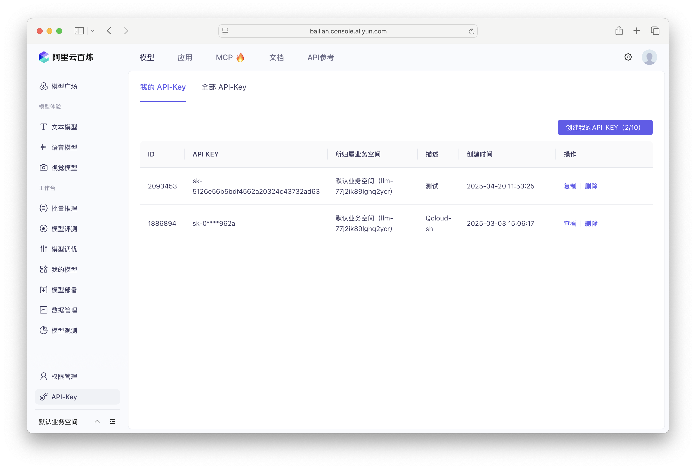
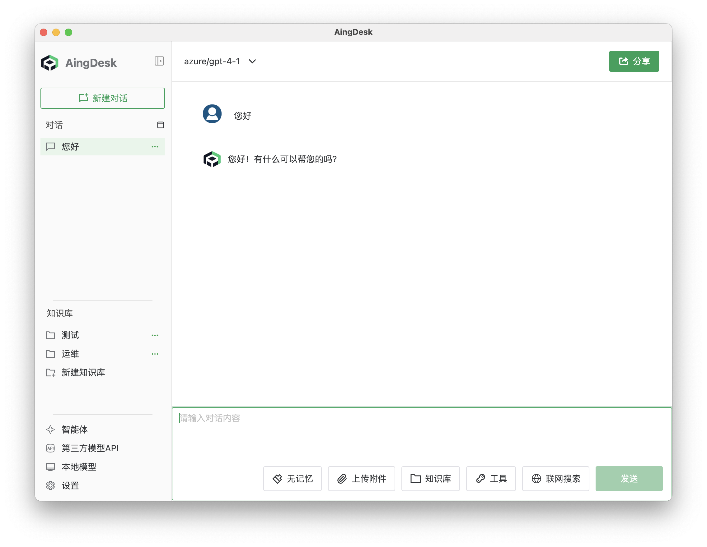
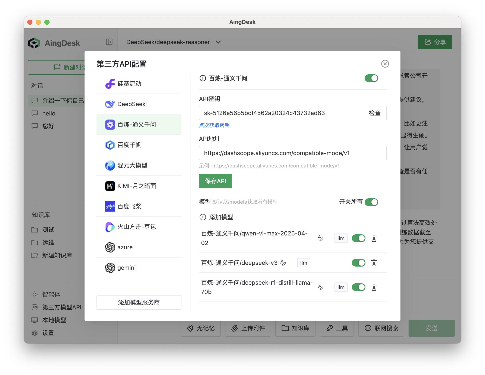
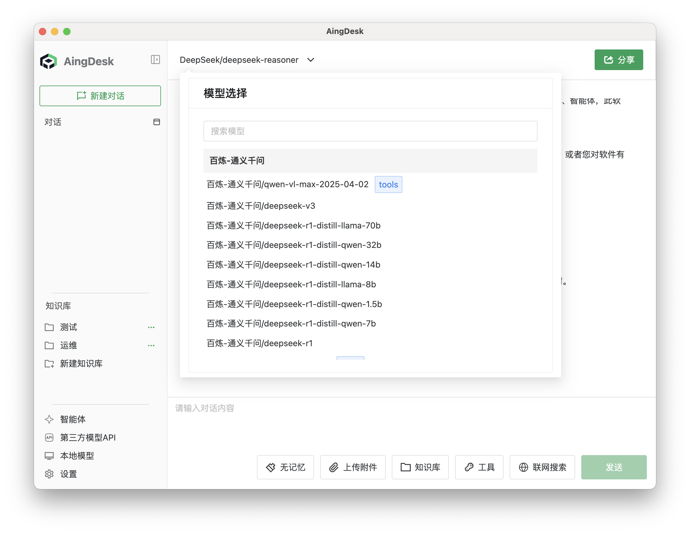
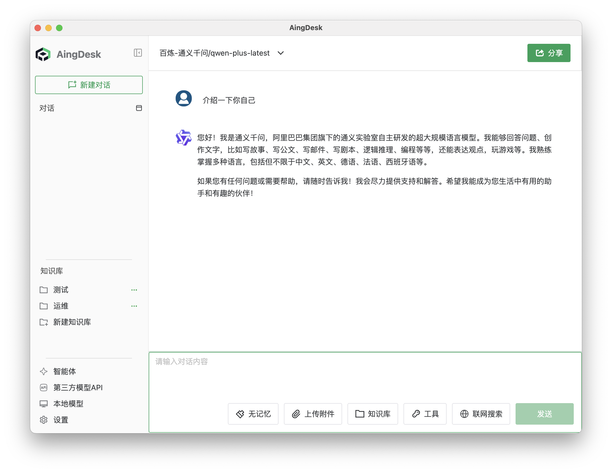

# 接入阿里云百炼API
## 操作场景
本文将指导您如何使用AingDesk接入阿里云百炼API（通义千问），从而使用阿里云提供的在线模型服务。
## 操作步骤
1. 登录[阿里云百炼控制台](https://bailian.console.aliyun.com/?tab=model#/model-market)，如果没有账号，请先注册。

2. 登陆后在左侧导航栏中点击 API-Key，进入 API 密钥页面。

3. 点击创建我的 API-Key，选择业务空间，输入密钥描述，点击确定创建。

4. 创建完成后在列表中找到刚刚创建的 API-Key，点击查看并复制 API-Key。

5. 打开 AingDesk，点击左侧导航栏中的“第三方API”，进入第三方 API 页面。

6. 在弹出的窗口中，选择“百炼-通义千问”，填入 API密钥，点击保存 API。

7. 关闭弹窗，回到对话页面，在左上角的“模型”下拉框中，选择“百炼-通义千问”，即可使用阿里云的模型服务。

8. 在对话框中输入问题，点击发送，即可使用阿里云的模型服务。
