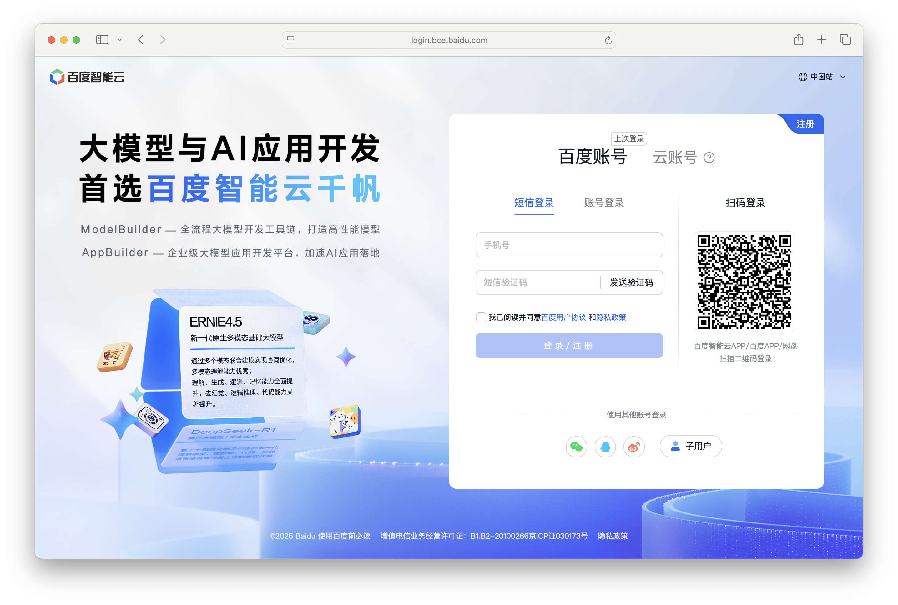

# 接入百度千帆 API
## 操作场景
本文将指导您如何使用 AingDesk 接入百度千帆 API，从而使用百度智能云提供的在线模型服务。

## 操作步骤
1. 登录[百度智能云控制台](https://console.bce.baidu.com/qianfan/modelcenter/model/buildIn/list)，如果没有账号，请先注册。

2. 登陆后在左侧导航栏中点击 API Key，进入 API 密钥页面。

3. 点击创建API Key，服务选择千帆ModelBuilder，资源选择所有资源，点击确定创建。

4. 创建完成后在弹出的窗口中复制 API Key。

5. 打开 AingDesk，点击左侧导航栏中的“第三方模型API”，进入第三方 API 页面。

6. 在第三方 API 页面中，选择“百度千帆”，填入 API 密钥，点击“保存 API”按钮。

7. 由于百度不会在 /models 接口返回模型列表，因此需要手动添加模型。点击“添加模型”按钮，输入模型 ID 和模型别名，并选择模型功能，点击“保存”按钮。

:::info 信息
- 模型别名：模型别名是您在 AingDesk 中使用的模型名称，可以自定义。
- 模型 ID：模型 ID 可以在百度千帆控制台的[文档](https://cloud.baidu.com/doc/WENXINWORKSHOP/s/em4tsqo3v)中找到，模型版本小写就是模型 ID。
- 模型功能：对话模型通常是LLM，请根据模型功能选择。
:::
8. 关闭弹窗，回到对话页面，在左上角的“模型”下拉框中，选择您刚刚添加的百度千帆模型。

9. 在对话框中输入问题，点击发送，即可使用百度千帆的模型服务。

