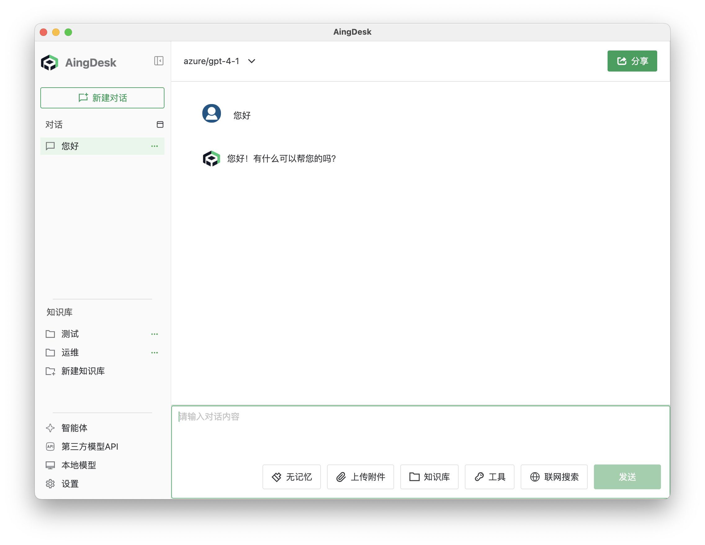

# 添加自定义模型供应商
## 操作场景
在使用第三方API时，如果AingDesk没有提供对应的API供应商，您可以通过添加自定义模型供应商来接入第三方API。
## 操作步骤
1. 登录AingDesk，点击左侧导航栏中的“第三方模型API”，进入第三方 API 页面。

2. 在第三方 API 页面中，点击左下角的“添加模型服务商”按钮。
3. 在弹出的窗口中，填写模型服务商名称、API地址和API密钥，点击“确认”按钮。

4. AingDesk 会尝试对应模型api的`/models`获取支持的模型列表，如未获取到模型列表，您可以手动添加模型。点击“添加模型”按钮，填写模型名称、模型ID和模型描述，点击“确认”按钮。

5. 关闭弹窗，回到对话页面，在左上角的“模型”下拉框中，找到添加的“自定义模型名称”，即可使用自定义模型服务商的模型服务。

6. 在对话框中输入问题，点击发送，即可使用自定义模型服务商的模型服务。
