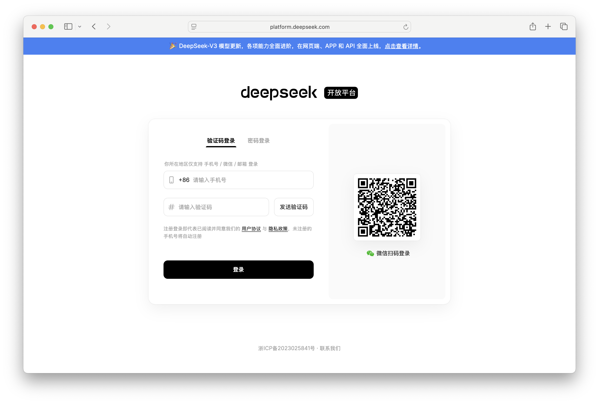
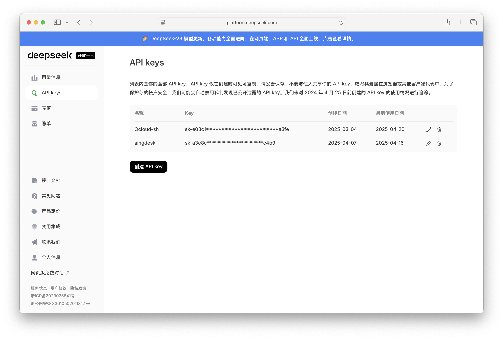
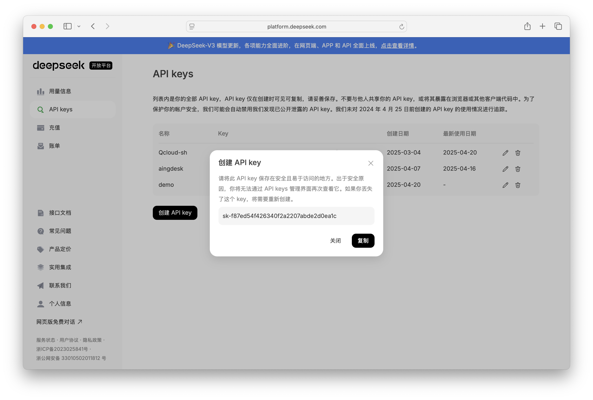
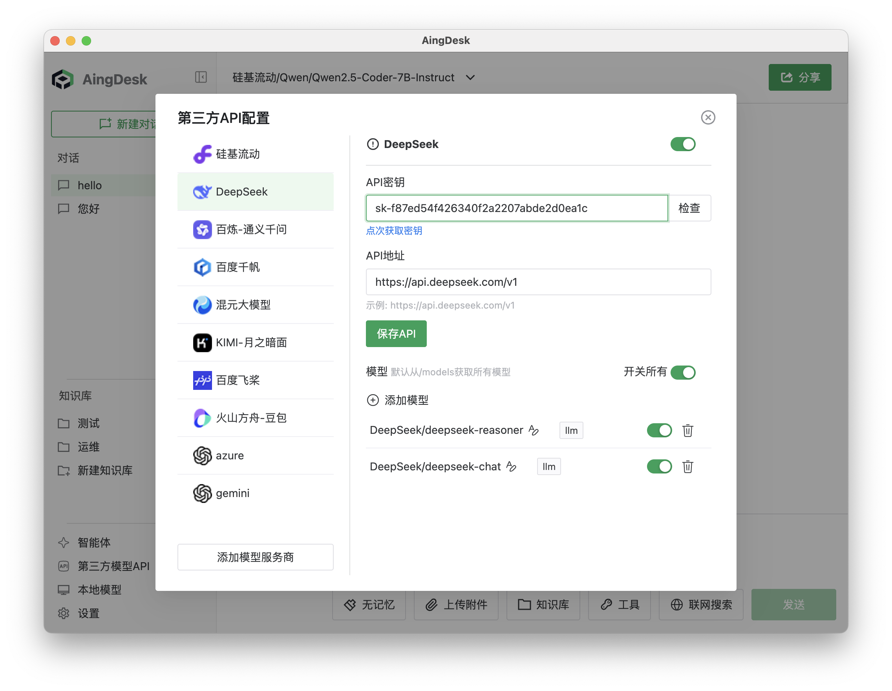
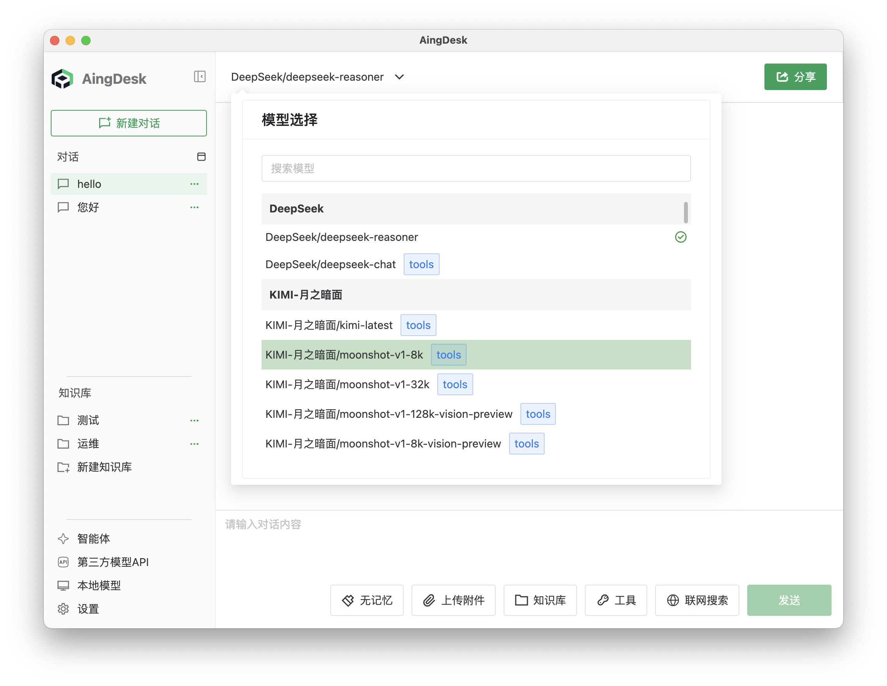
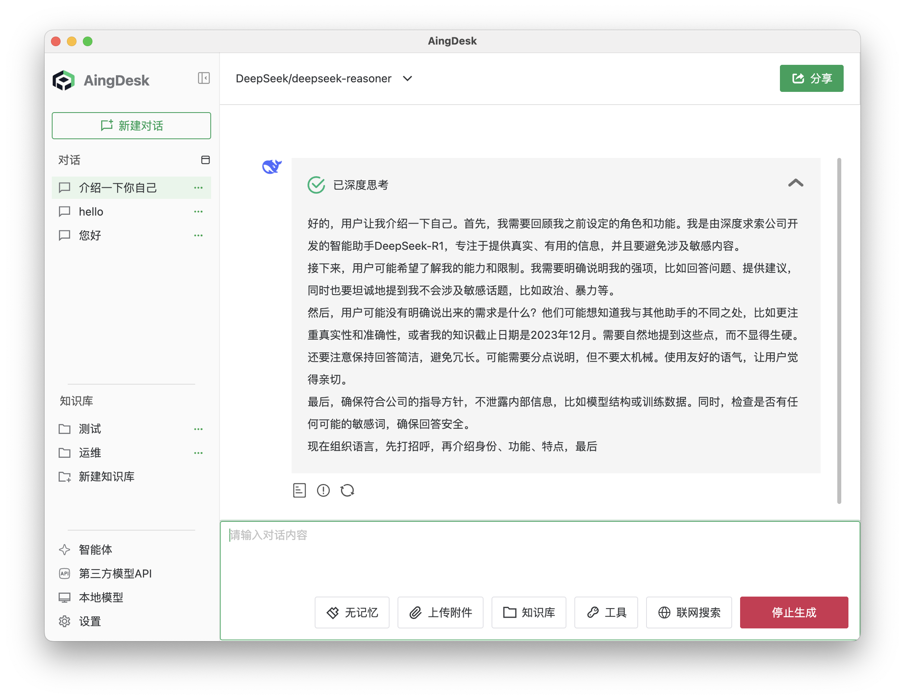

# 接入DeepSeek API
## 操作场景
本文将指导您如何使用AingDesk接入DeepSeek API，从而使用DeepSeek提供的在线模型服务。
## 操作步骤
1. 登录[DeepSeek 开放平台](https://platform.deepseek.com/sign_in)，如果没有账号，请先注册。

2. 登陆后在左侧导航栏中点击 API key，进入 API 密钥页面。

3. 点击创建 API key，输入密钥描述，点击确定创建，创建成功后，点击复制按钮，复制 API 密钥。

::: warning 警告
请将此 API key 保存在安全且易于访问的地方。出于安全原因，你将无法通过 API keys 管理界面再次查看它。如果你丟失了这个 key，将需要重新创建。
:::
::: tip 提示
DeepSeek 当前注册后似乎已经没有赠送免费额度了，建议使用时注意查看余额。
:::
4. 打开 AingDesk，点击左侧导航栏中的“第三方模型API”，进入第三方 API 页面。

5. 在弹出的窗口中，选择“DeepSeek”，填入 API 密钥，点击保存 API。

::: tip 提示
正常情况下，点击保存 API 后，AingDesk 会自动获取 DeepSeek 的模型列表，如未获取到，请检查配置是否正确。
:::
6. 关闭弹窗，回到对话页面，在左上角的“模型”下拉框中，选择“DeepSeek 相关模型”，即可使用 DeepSeek 的模型服务。

在对话框中输入问题，点击发送，即可使用 DeepSeek 的模型服务。
