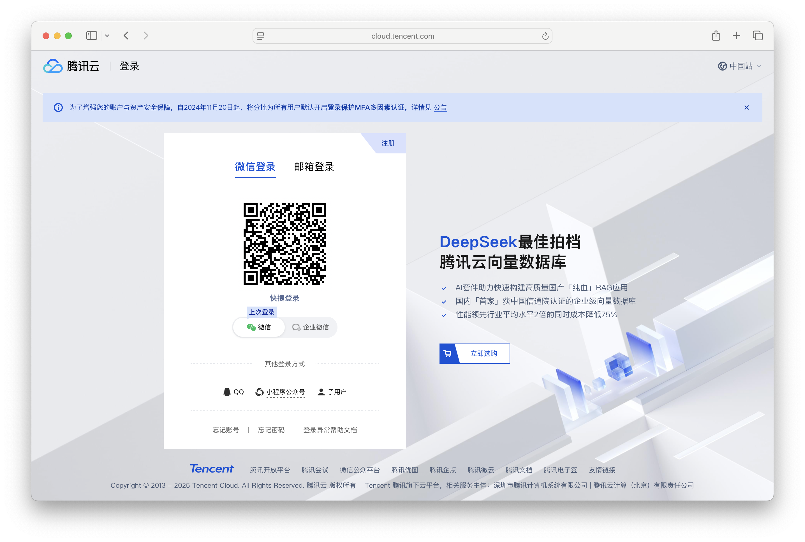
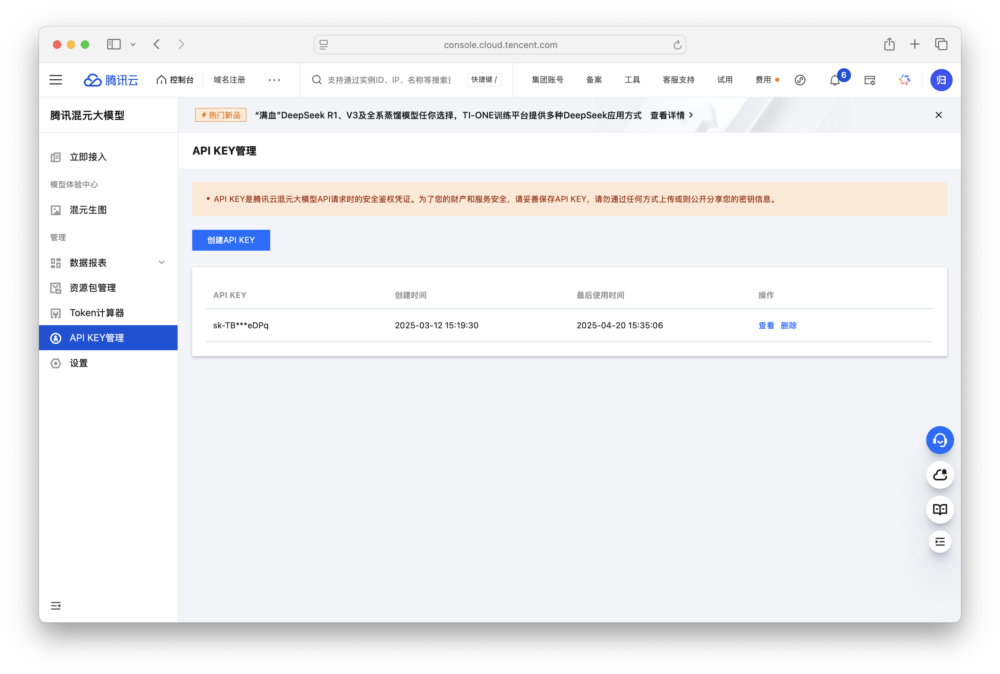
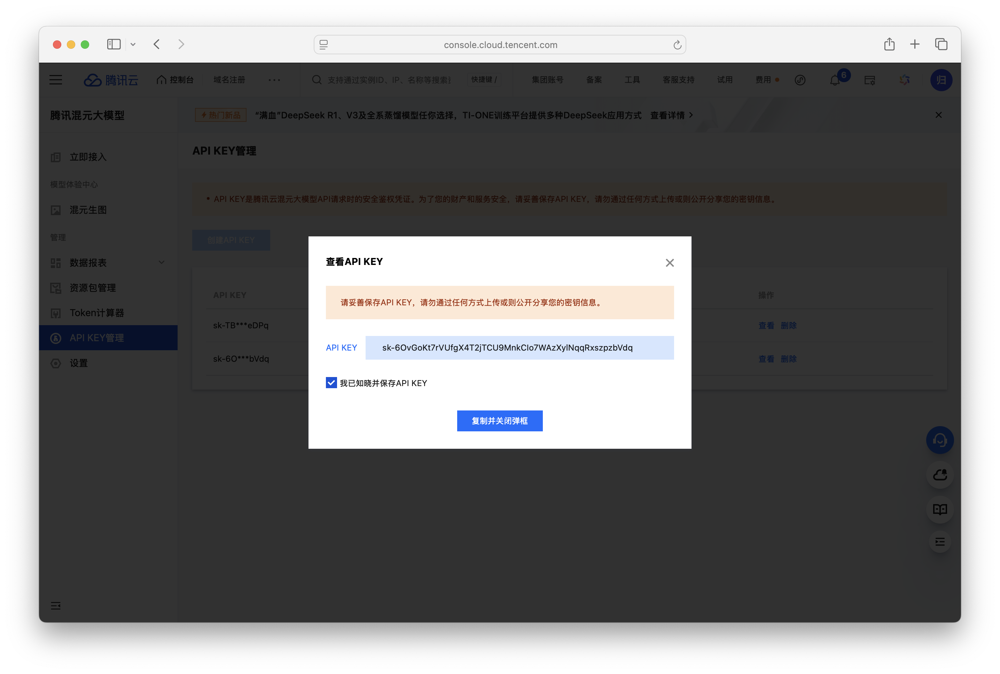
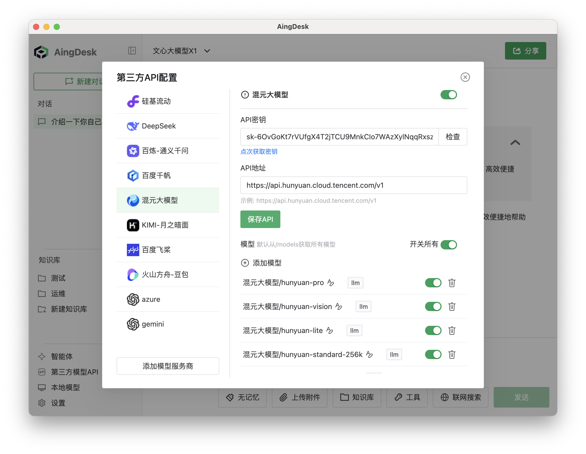
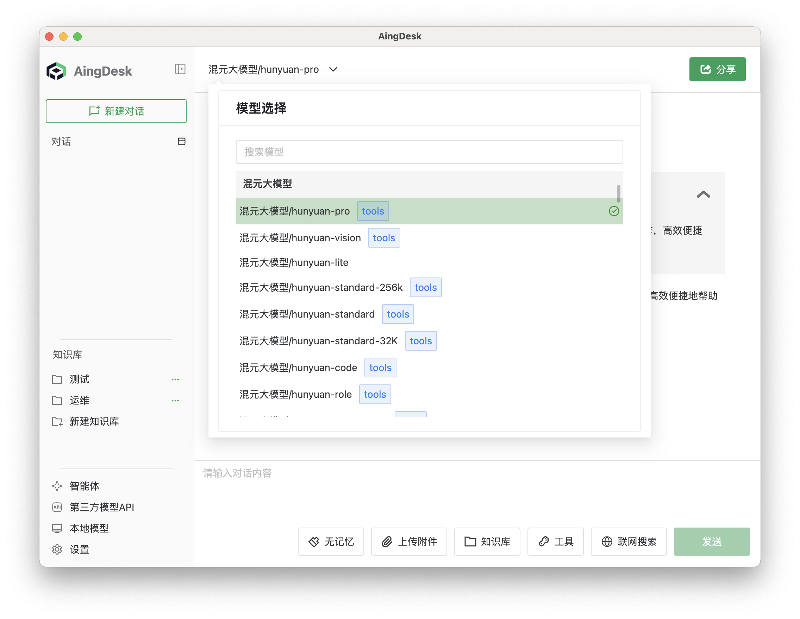
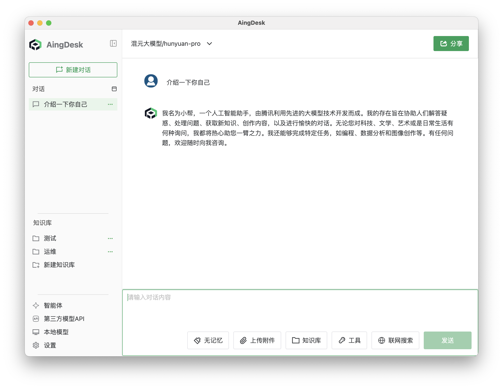

# 接入腾讯混元 API
## 操作场景
本文将指导您如何使用 AingDesk 接入腾讯混元 API，从而使用腾讯混元提供的在线模型服务。

## 操作步骤
1. 登录[腾讯云混元大模型控制台](https://console.cloud.tencent.com/hunyuan/start)，如果没有账号，请先注册。

2. 登陆后在左侧导航栏中点击 API KEY 管理，进入 API 密钥页面。

3. 点击创建 API KEY，创建完成后点击查看，复制 API KEY。

4. 打开 AingDesk，点击左侧导航栏中的“第三方模型API”，进入第三方 API 页面。

5. 在第三方 API 页面中，选择“混元大模型”，填入 API 密钥，点击“保存 API”按钮。

::: tip 提示
正常情况下，点击保存API后，AingDesk 会自动获取腾讯混元的模型列表，如未获取到，请检查配置是否正确。
:::
6. 关闭弹窗，回到对话页面，在左上角的“模型”下拉框中，选择“混元大模型相关模型”，即可使用混元大模型的模型服务。

在对话框中输入问题，点击发送，即可使用混元大模型的模型服务。
