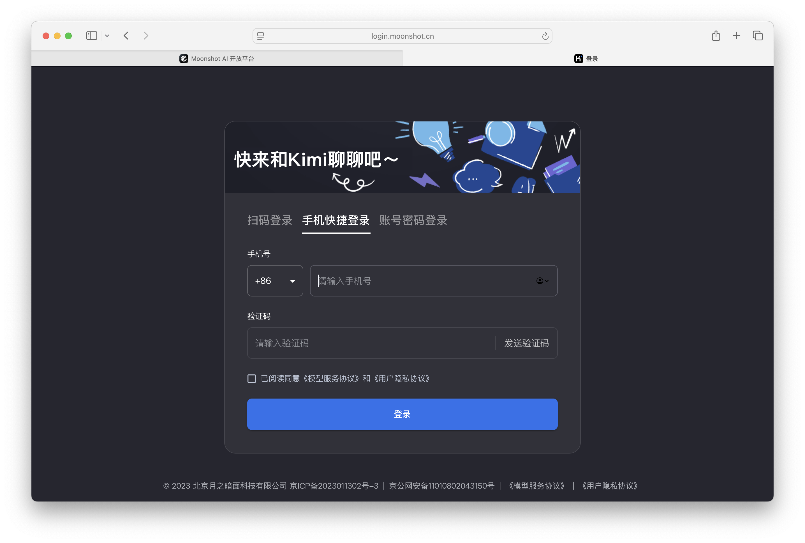
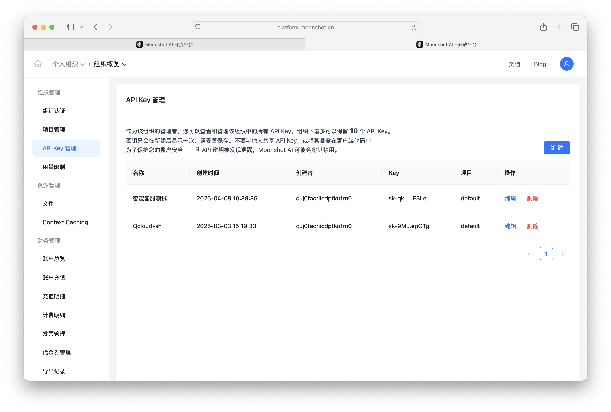
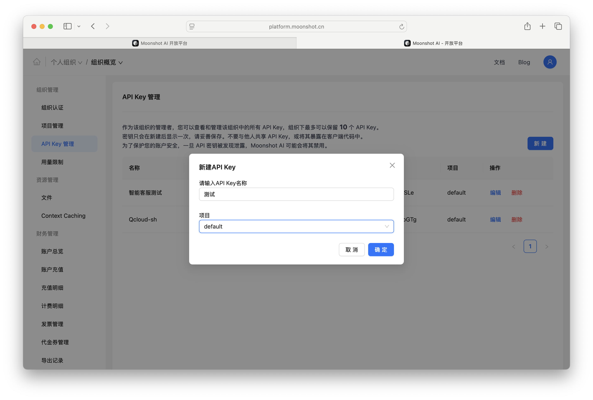
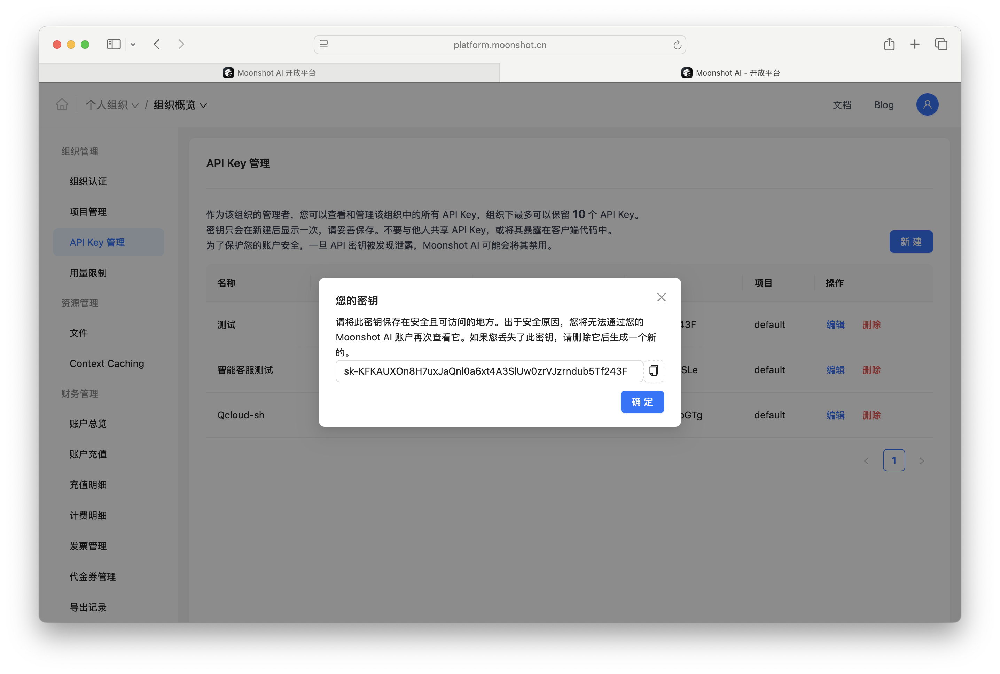
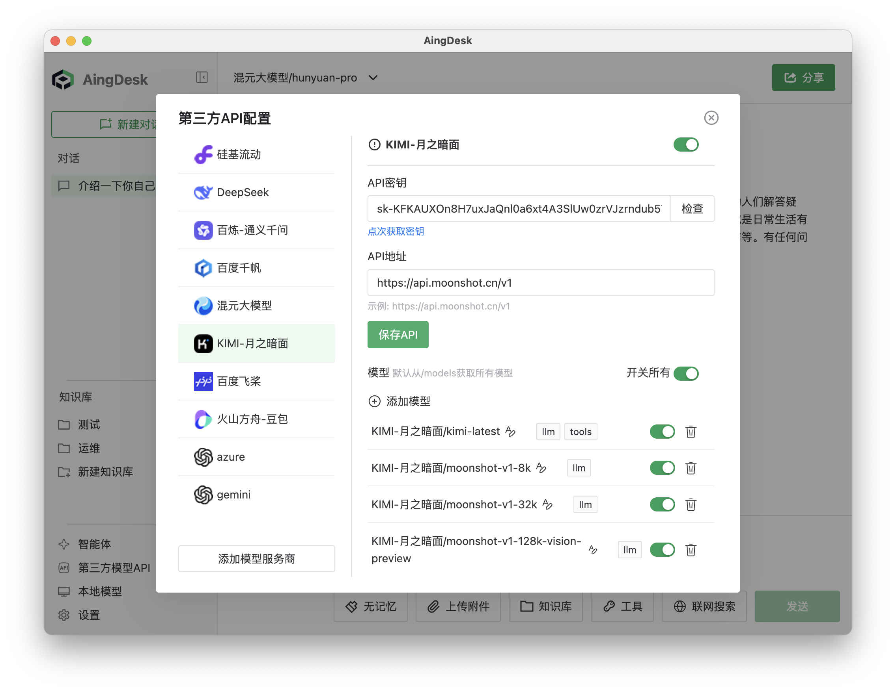
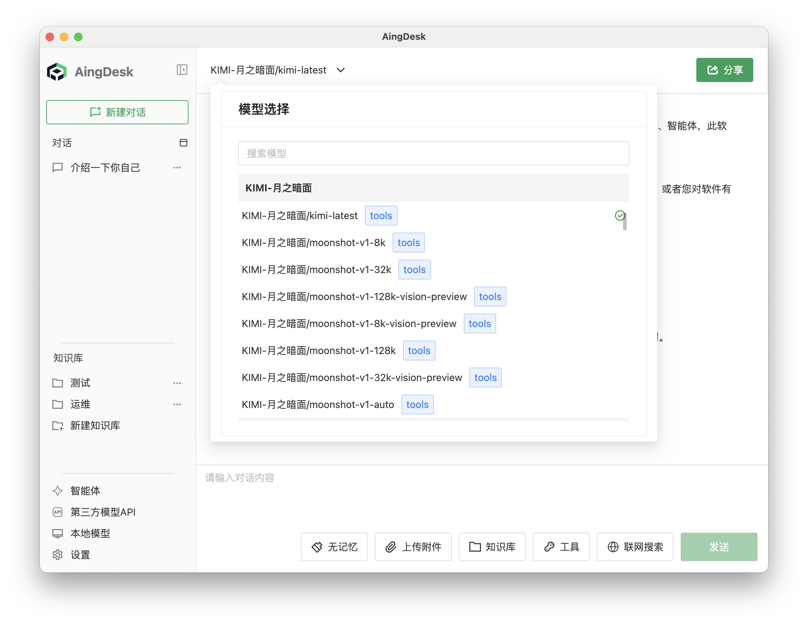
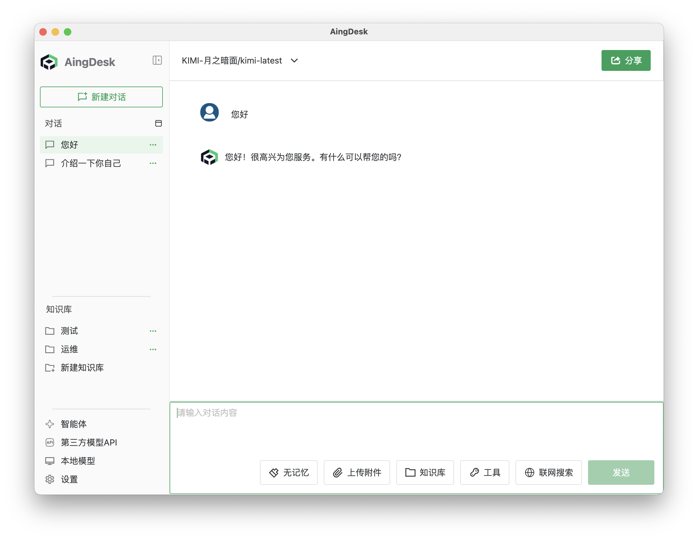

# 接入 KIMI API
## 操作场景
本文将指导您如何使用 AingDesk 接入 KIMI API，从而使用 KIMI 提供的在线模型服务。
## 操作步骤
1. 登录[KIMI 控制台](https://platform.moonshot.cn/console/account)，如果没有账号，请先注册。

2. 登陆后在左侧导航栏中点击 API Key 管理，进入 API 密钥页面。

3. 点击新建，设置API所属项目和名称，点击确定。

4. 创建完成后，复制保存 API 密钥。

5. 打开 AingDesk，点击左侧导航栏中的“第三方模型API”，进入第三方 API 页面。

6. 在第三方 API 页面中，选择“KIMI-月之暗面”，填入 API 密钥，点击“保存 API”按钮。

7. 关闭弹窗，回到对话页面，在左上角的“模型”下拉框中，选择“KIMI-月之暗面相关模型”，即可使用 KIMI 的模型服务。

8. 在对话框中输入问题，点击发送，即可使用 KIMI 的模型服务。
