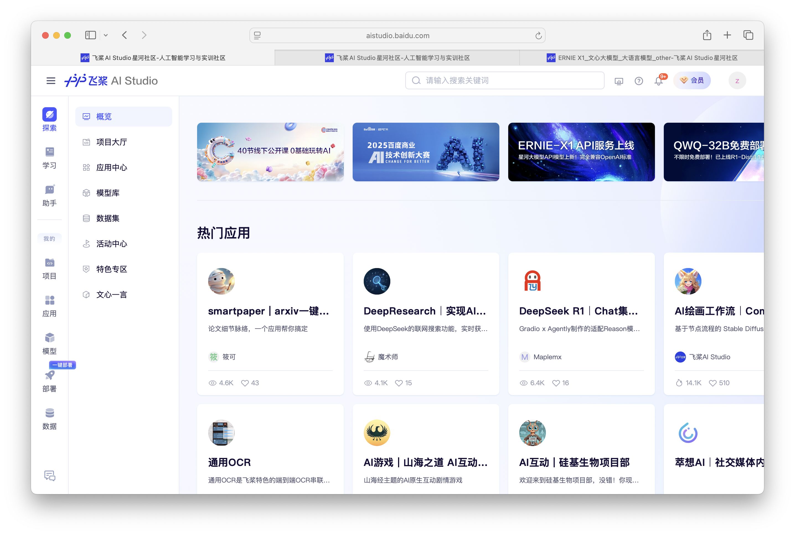
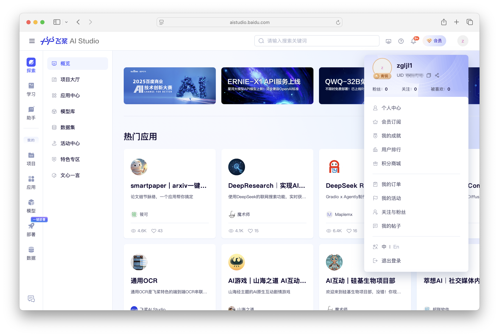
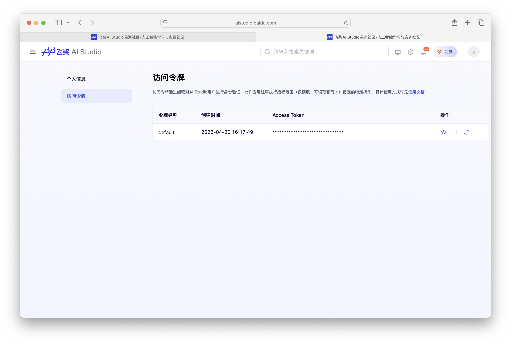
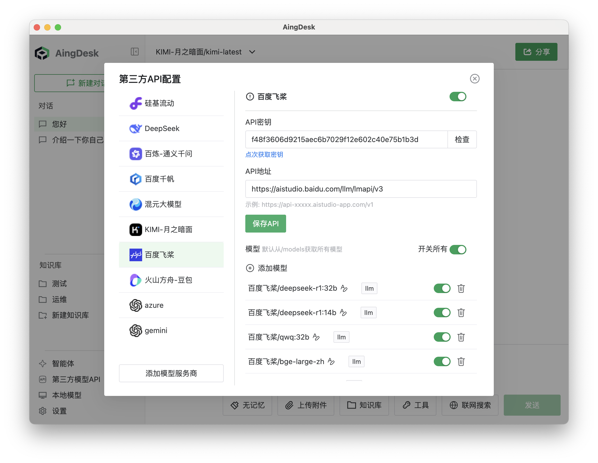
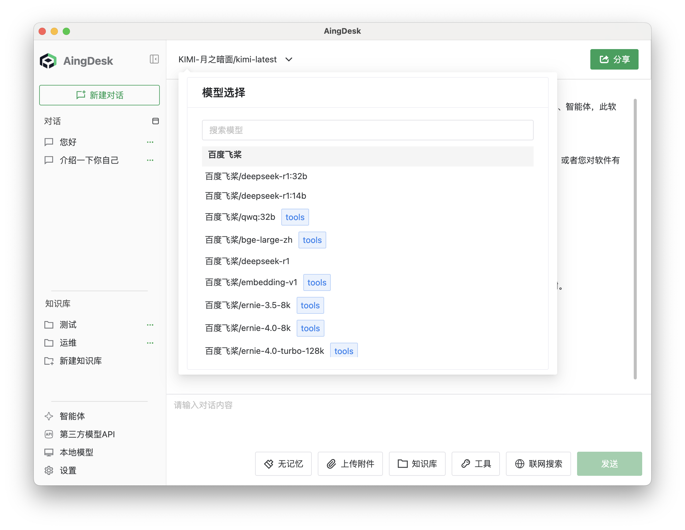
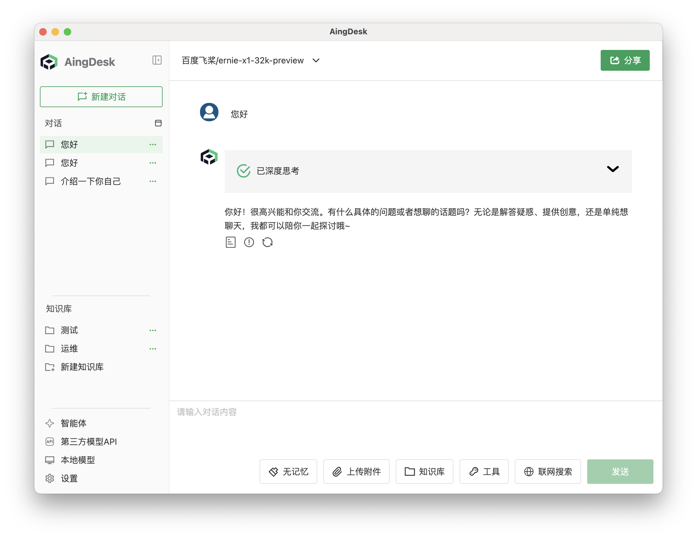

# 接入百度飞桨 API
## 操作场景
本文将指导您如何使用 AingDesk 接入百度飞桨 API，从而使用百度飞桨提供的在线模型服务。
## 操作步骤
1. 登录[百度飞桨控制台](https://aistudio.baidu.com/overview)，如果没有账号，请先注册。

2. 登陆后点击右上角头像，进入个人中心，点击左侧导航栏中的访问令牌，进入 API 密钥页面。

3. 百度飞桨默认会生成一个访问令牌，您可以直接使用，点击复制保存访问令牌。

4. 打开 AingDesk，点击左侧导航栏中的“第三方模型API”，进入第三方 API 页面。

5. 在第三方 API 页面中，选择“百度飞桨”，填入访问令牌。

::: tip 提示
- 如果您在百度飞桨创建了自己的应用，请更换接口地址为百度飞桨提供的专属地址。
- 如果您只是单纯希望使用百度飞桨的模型服务，请更换接口地址为百度飞桨提供的公共地址`https://aistudio.baidu.com/llm/lmapi/v3`
:::
6. 点击“保存 API”按钮，关闭弹窗，回到对话页面，在左上角的“模型”下拉框中，选择“百度飞桨相关模型”，即可使用百度飞桨的模型服务。

在对话框中输入问题，点击发送，即可使用百度飞桨的模型服务。
