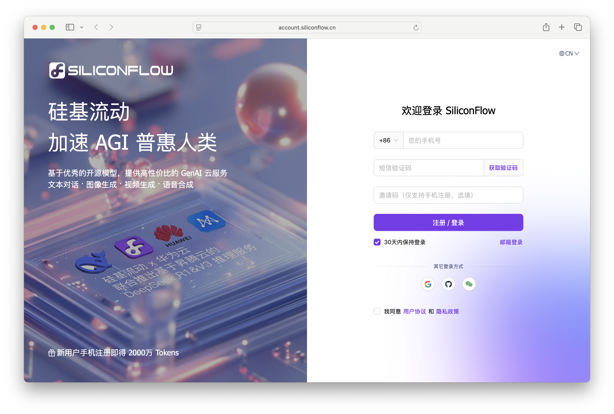
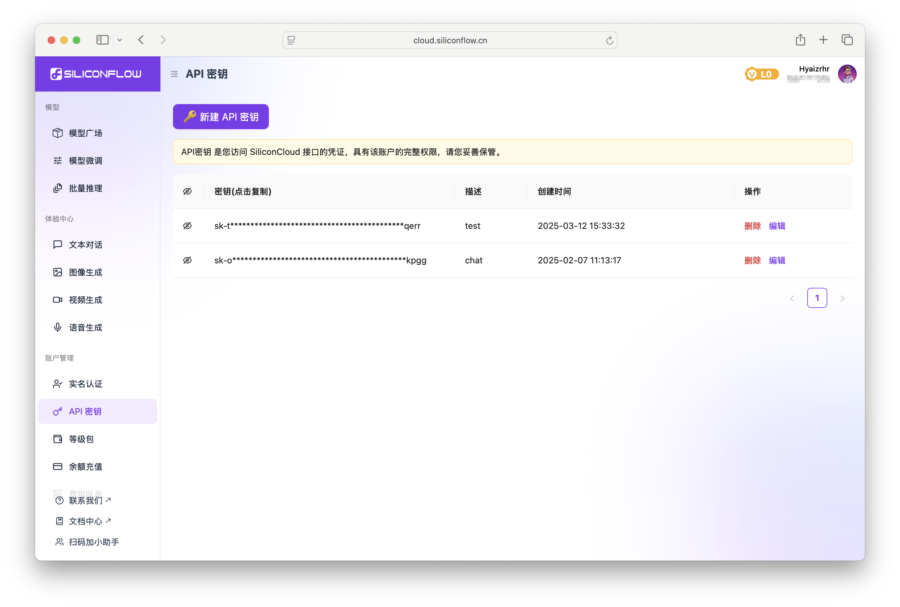
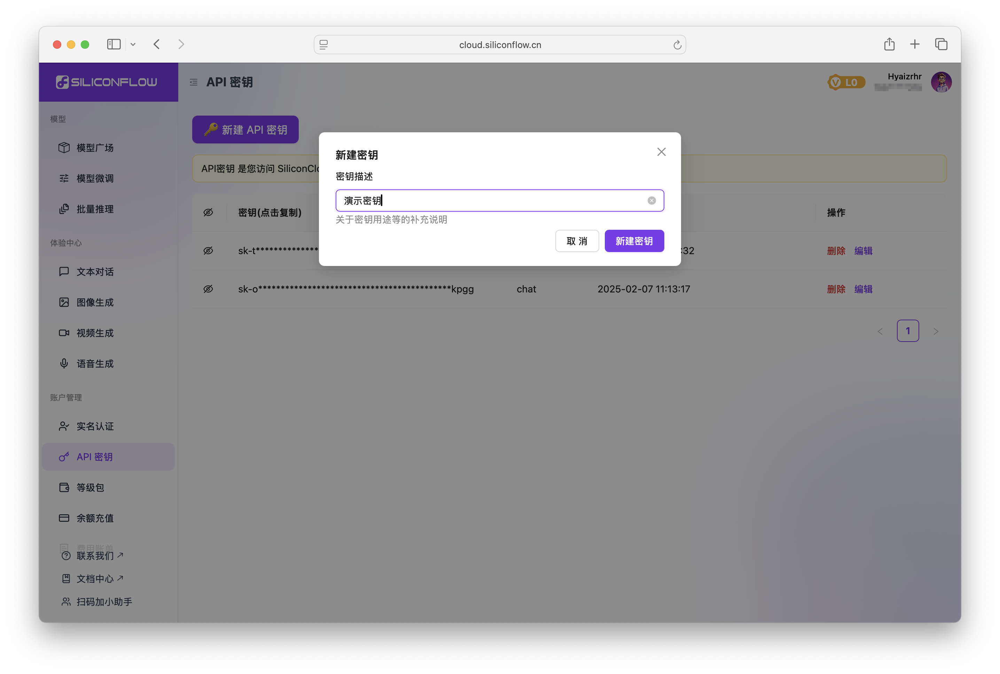
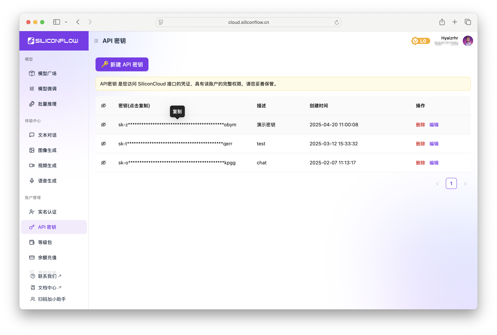
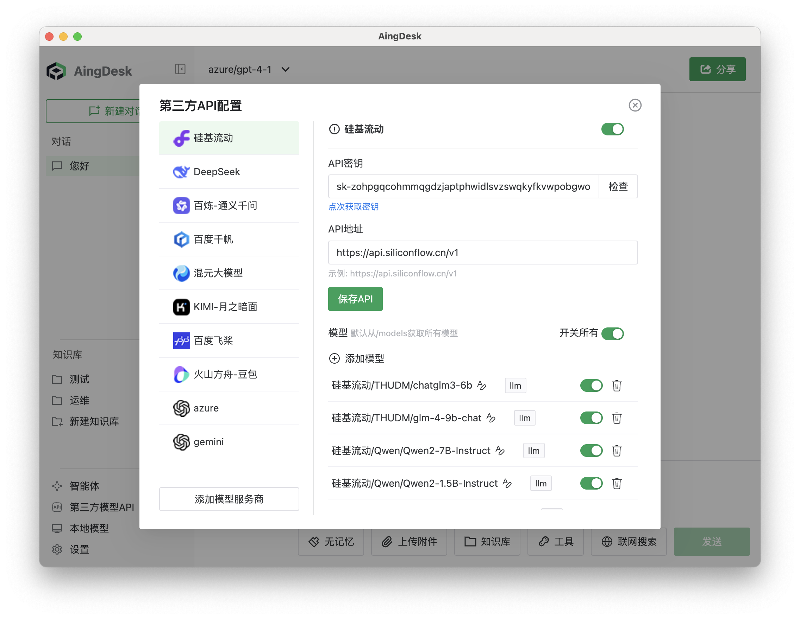
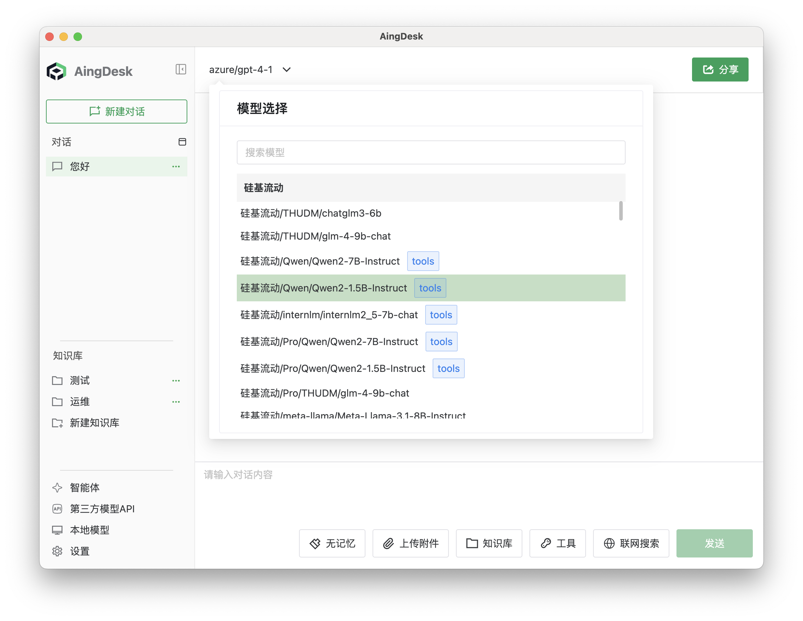

# 接入硅基流动API
## 操作场景
本文将指导您如何使用AingDesk接入硅基流动API，从而使用硅基流动流动提供的在线模型服务。
## 操作步骤
1. 登录[硅基流动](https://account.siliconflow.cn/zh/login)平台，如果没有账号，请先注册。

2. 登陆后在左侧导航栏中点击API密钥，进入API密钥页面。

3. 点击创建API密钥，输入密钥描述，点击确定。

4. 创建成功后，点击密钥复制按钮，复制API密钥。

5. 打开AingDesk，点击左侧导航栏中的“第三方API”，进入第三方API页面。

6. 在弹出的窗口中，选择“硅基流动”，填入API密钥，点击保存API。

::: info 提示
正常情况下，点击保存API后，AingDesk会自动获取硅基流动的模型列表，如未获取到，请检查配置是否正确。
:::
7. 关闭弹窗，回到对话页面，在左上角的“模型”下拉框中，选择“硅基流动相关模型”，即可使用硅基流动的模型服务。
