# 接入火山方舟 API
## 操作场景
本文将指导您如何使用 AingDesk 接入火山方舟 API，从而使用火山引擎提供的在线模型服务。
## 操作步骤
1. 登录[火山方舟控制台](https://console.volcengine.com/ark/)，如果没有账号，请先注册。
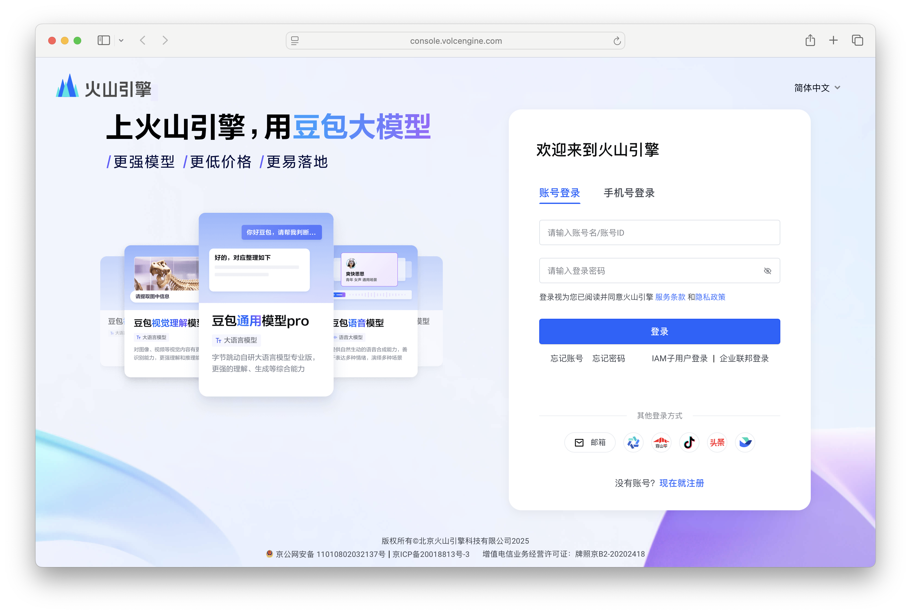
2. 登陆后在左侧导航栏中点击 API Key 管理，进入 API 密钥页面。
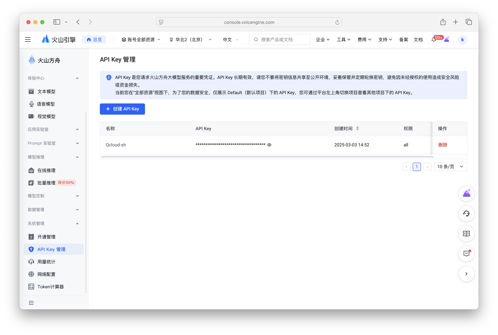
3. 点击创建 API Key，设置名称，点击确定。
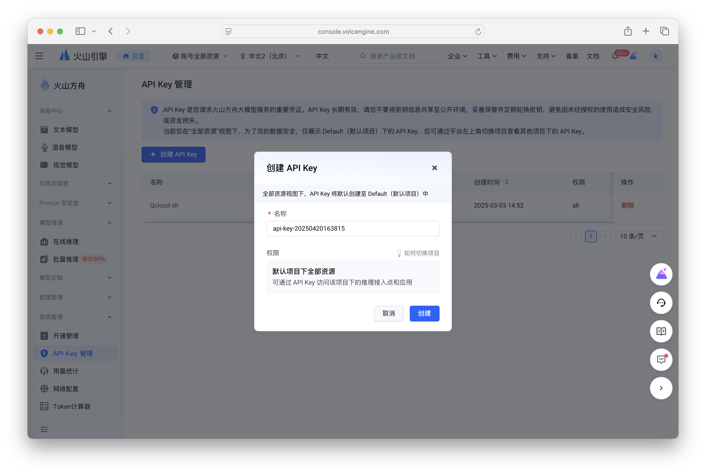
4. 创建完成后，点击查看，复制 API Key。
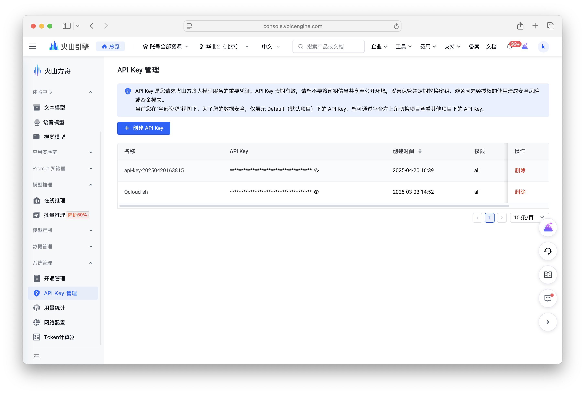
5. 打开 AingDesk，点击左侧导航栏中的“第三方模型API”，进入第三方 API 页面。

6. 在第三方 API 页面中，选择“火山方舟”，填入 API Key，点击“保存 API”按钮。
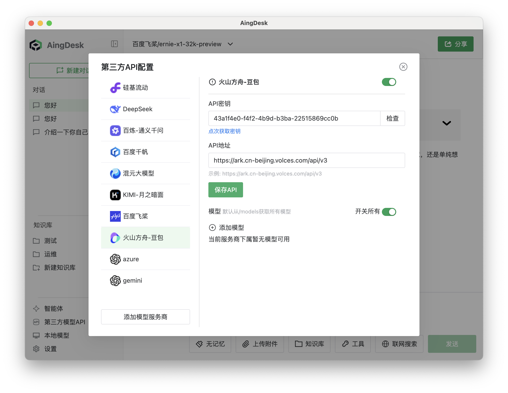
7. 火山方舟使用方式比较特殊，需要先创建一个在线推理点，回到火山方舟控制台，点击在线推理-自定义推理接入点，进入在线推理接入点页面。
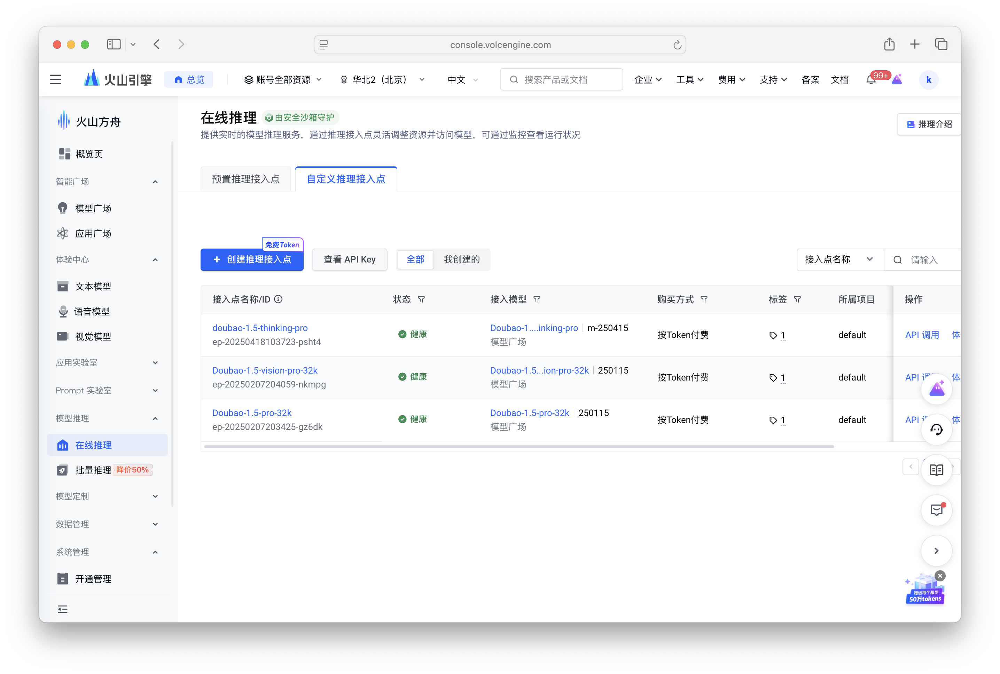
8. 点击创建推理接入点，设置名称和选择需要使用的模型，点击创建。
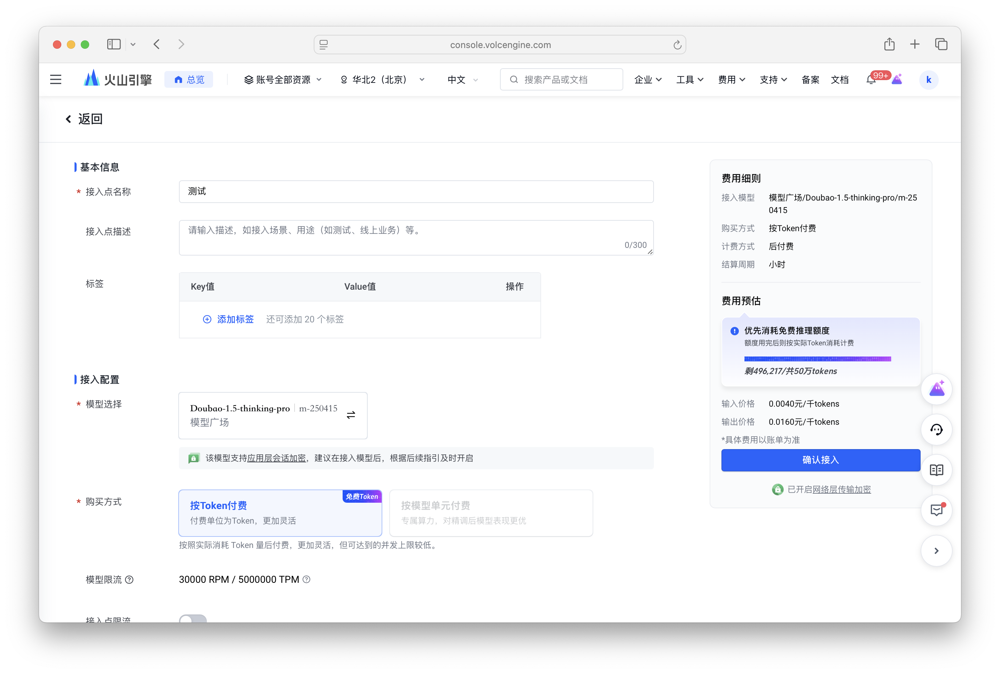
9. 创建完成后复制接入点id。
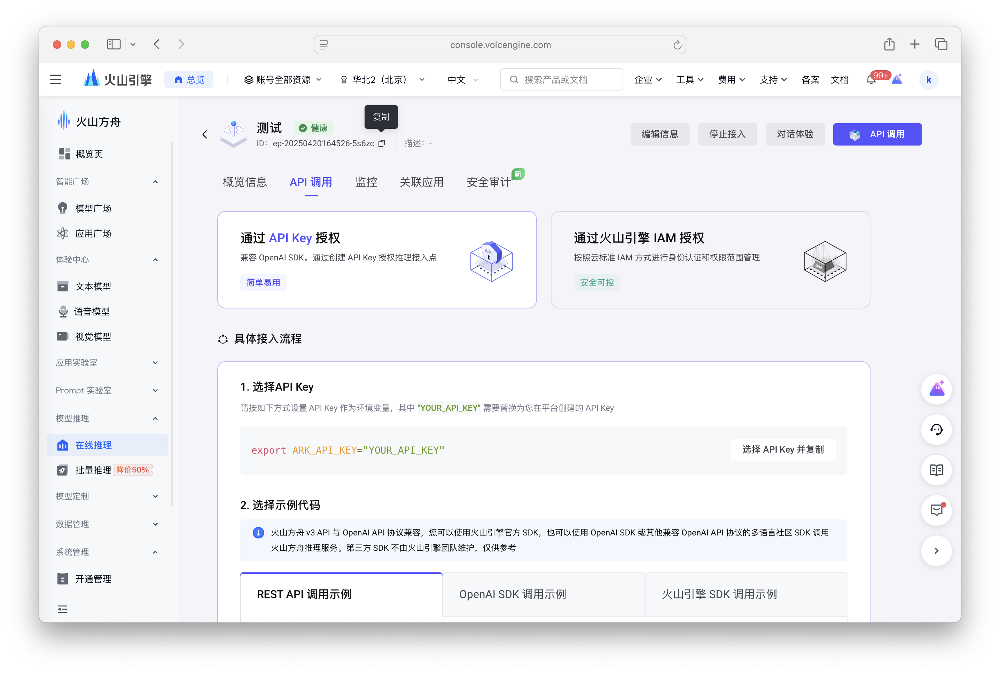
10. 回到 AingDesk第三方 API 页面，点击添加模型，模型id填写接入点id，模型功能选择LLM，模型名称可以自定义，点击确定。 
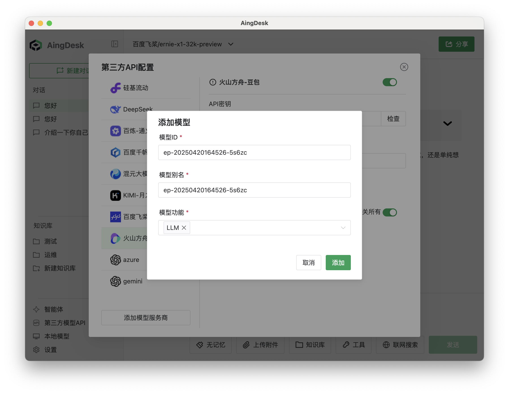
11. 关闭弹窗，回到对话页面，在左上角的“模型”下拉框中，选择“火山方舟相关模型”，即可使用火山方舟的模型服务。
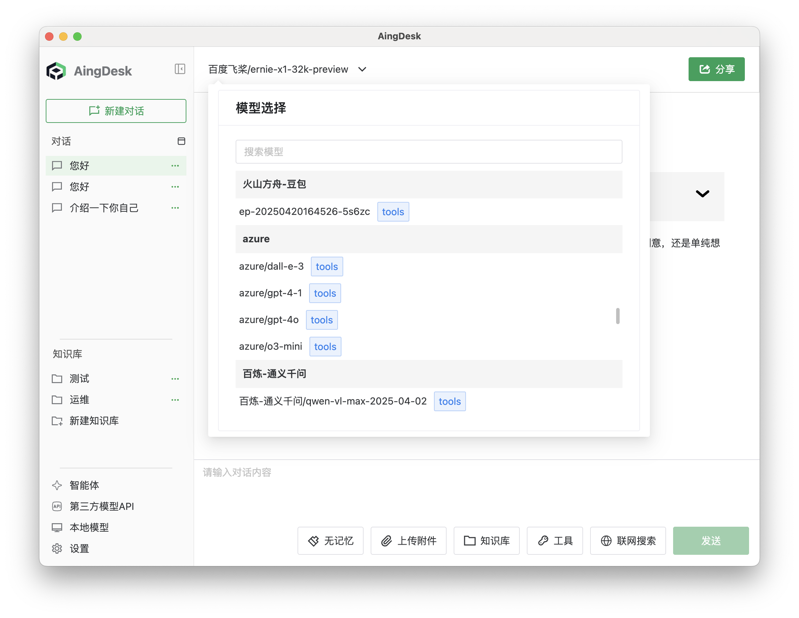
12. 在对话框中输入问题，点击发送，即可使用火山方舟的模型服务。
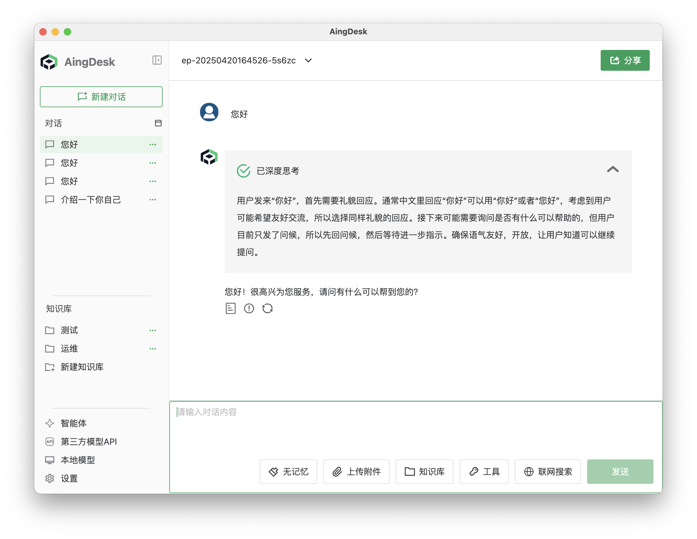